# Database Internals: A Distributed-Systems Engineer's Guide

A useful mental model is to think of a database as a **state machine sitting between unreliable storage, concurrent clients, and a potentially unreliable network**.

At a high level:

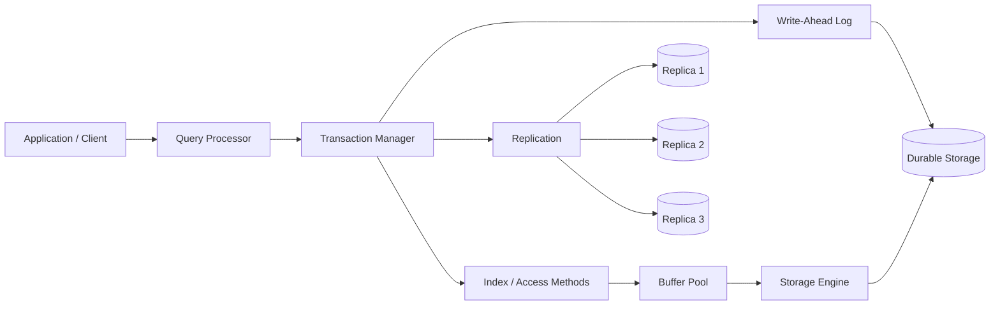

The important question behind almost every database-internals decision is:

> **Where is state stored, when is it considered durable, and how do multiple readers/writers safely observe and modify that state?**

---

# 1. Storage Engines

A **storage engine** is the component responsible for translating logical database operations such as:

```sql
INSERT INTO users VALUES (...);
SELECT * FROM users WHERE id = 42;
```

into physical operations on memory and persistent storage.

The two most important families are:

* **B-tree-based engines**
* **LSM-tree-based engines**

---

## 1.1 Why databases don't simply use files

Suppose you have:

```text
users.dat

Alice
Bob
Charlie
...
10 billion rows
```

Finding `Charlie` by scanning the file is:

```text
O(N)
```

A database instead constructs structures that make lookup approximately:

```text
O(log N)
```

while also optimizing:

* sequential I/O
* random I/O
* memory locality
* concurrent access
* crash recovery
* writes
* range scans

This is where B-trees, LSM trees, pages, and buffer pools enter the picture.

---

# 1.2 Pages: the fundamental storage unit

Databases generally don't read/write individual rows directly from disk.

They organize data into **pages**.

Typical page sizes are around 4 KiB–16 KiB, although implementations vary considerably.

Conceptually:

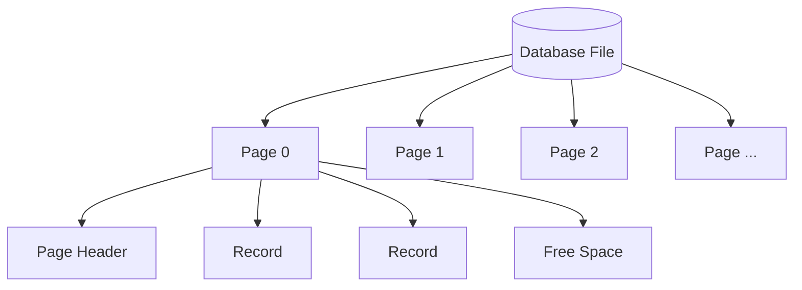

A page might contain:

* page ID
* metadata
* tuple/record pointers
* records
* free-space information
* checksums
* transaction metadata

### Why pages?

Because storage devices have significant fixed costs around I/O.

Instead of:

```text
read row 42
read row 43
read row 44
...
```

the database can perform:

```text
read page 17
```

and obtain many records at once.

---

## 1.3 Slotted pages

A common layout for variable-sized records is the **slotted page**.

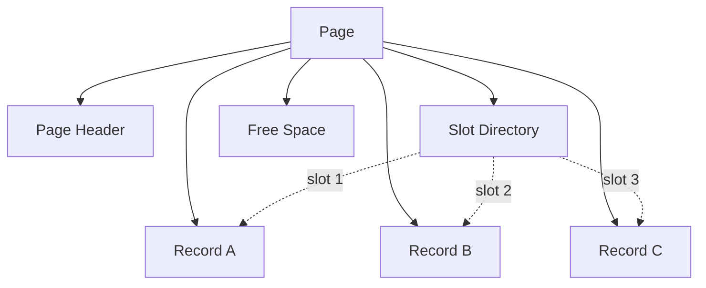

The slot directory gives records stable logical identifiers even when records move inside the page.

This matters because:

* records can have variable sizes
* records may move during compaction
* pointers don't necessarily need to encode the physical byte offset

A common conceptual identifier is:

```text
(page_id, slot_id)
```

rather than:

```text
(file_offset)
```

---

# 1.4 Buffer Pool

Disk is dramatically slower than RAM.

Consequently, databases maintain a **buffer pool**:

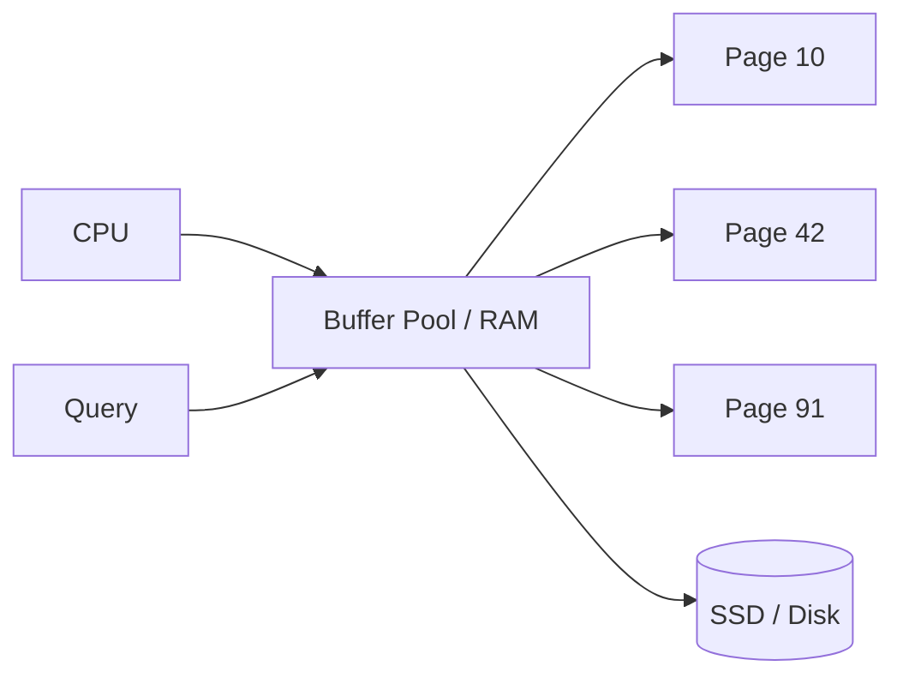

The buffer pool is essentially a database-managed cache of disk pages.

Instead of:

```text
query -> disk
```

you want:

```text
query -> RAM
```

most of the time.

---

## Buffer pool terminology

### Page hit

The required page is already in memory.

```text
Query -> Buffer Pool -> Page
```

Fast.

### Page miss

The page isn't in memory.

```text
Query -> Buffer Pool -> SSD -> Buffer Pool -> Query
```

Much slower.

### Dirty page

A page modified in memory but not yet persisted.

```text
Disk:
A = 10

RAM:
A = 11
```

The RAM version is **dirty**.

Eventually it must be flushed.

---

## Buffer replacement

The buffer pool cannot contain the entire database.

Therefore, pages need to be evicted.

Common strategies include:

* LRU-like algorithms
* clock algorithms
* workload-aware policies
* adaptive replacement strategies

A naïve LRU can behave badly for large sequential scans.

For example:

```text
RAM:
A B C D

Sequential scan:
E F G H I J K L ...
```

The scan can continuously evict useful pages.

This is sometimes called **buffer pool pollution**.

---

# 1.5 B-trees

B-trees are among the most important database data structures.

Conceptually:

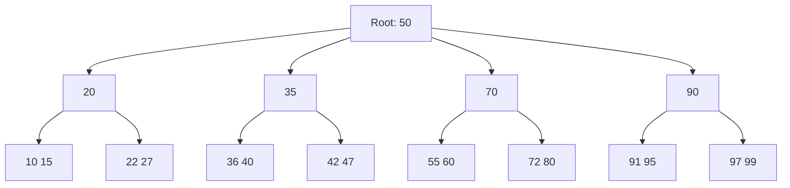

The tree is kept balanced.

The important property is:

> Each internal node contains many keys, not merely two.

That produces a **high branching factor**.

For a database, that's extremely useful because one node can correspond roughly to one storage page.

---

## B-tree lookup

Suppose:

```text
Search key = 72
```

The database might perform:

```text
Root
  ↓
70
  ↓
72
```

If the tree has height `h`, lookup is approximately:

```text
O(log_B N)
```

where `B` is the branching factor.

Because `B` can be large, real database B-trees are often surprisingly shallow.

For millions or billions of records, you may only need a handful of page accesses.

---

# 1.6 Why B-trees work well for databases

B-trees support:

### Point lookup

```sql
WHERE id = 123
```

### Range queries

```sql
WHERE age BETWEEN 20 AND 30
```

### Ordering

```sql
ORDER BY created_at
```

### Prefix/range traversal

For example:

```sql
WHERE timestamp >= T1
  AND timestamp < T2
```

This is one reason B-trees remain dominant in relational databases.

---

# 1.7 B+ trees

Most modern database indexes are conceptually closer to **B+ trees**.

The important distinction is that:

* internal nodes contain search keys
* leaf nodes contain pointers/data
* leaf nodes are commonly linked

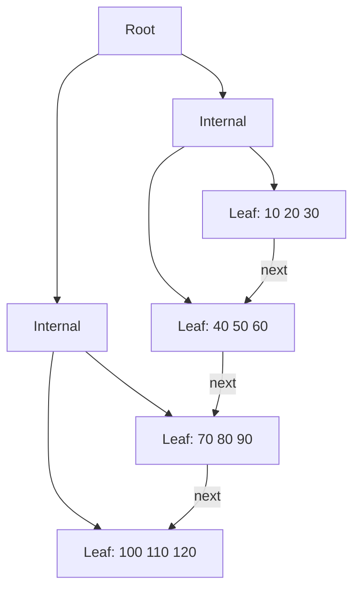

That leaf-level linked structure makes range scans efficient.

---

# 1.8 LSM Trees

LSM stands for **Log-Structured Merge Tree**.

The key idea is radically different from a traditional B-tree:

> Instead of constantly modifying data in place, accumulate writes and periodically merge sorted structures.

Conceptually:

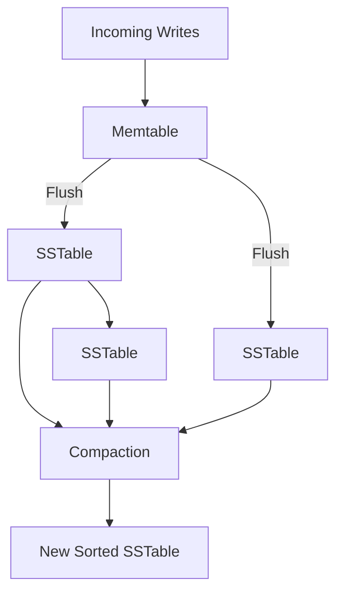

An LSM database commonly has:

* a memory-resident structure
* immutable SSTables
* background compaction
* a WAL for durability

---

## 1.9 Memtable

Incoming writes initially go into a memory structure called a **memtable**.

For example:

```text
put(user:42, Alice)
put(user:17, Bob)
put(user:42, Alicia)
```

The memtable maintains an ordered representation.

Once it reaches some threshold:

```text
Memtable
   ↓
Flush
   ↓
Immutable SSTable
```

---

# 1.10 SSTables

SSTable means **Sorted String Table**.

An SSTable is generally:

* immutable
* sorted by key
* persisted sequentially

Example:

```text
SSTable 1

10 -> Alice
20 -> Bob
30 -> Charlie
40 -> David
```

Because the file is sorted, it can be efficiently searched and compressed.

---

# 1.11 Compaction

Eventually you have:

```text
SSTable A:
10 -> Alice
30 -> Charlie

SSTable B:
20 -> Bob
30 -> Alicia
40 -> David
```

The database merges them:

```text
10 -> Alice
20 -> Bob
30 -> Alicia
40 -> David
```

The obsolete value:

```text
30 -> Charlie
```

can disappear.

This is **compaction**.

---

## Why LSM trees are excellent for writes

Imagine modifying a B-tree repeatedly:

```text
random write
random write
random write
random write
```

You may incur many random page updates.

An LSM can instead turn them into:

```text
append/sequential writes
       ↓
memtable
       ↓
sequential SSTable creation
       ↓
background merge
```

This can produce extremely high write throughput.

---

## The cost: write amplification

A record may be written multiple times:

```text
WAL
 ↓
Memtable
 ↓
SSTable
 ↓
Compaction
 ↓
Compaction again
```

If one logical byte results in many physical bytes written, that's **write amplification**.

LSM engines therefore have a fundamental trade-off:

| Property               | B-tree    | LSM                         |
| ---------------------- | --------- | --------------------------- |
| Point reads            | Excellent | Good, potentially more work |
| Range scans            | Excellent | Good                        |
| Write throughput       | Good      | Often excellent             |
| Write amplification    | Moderate  | Potentially high            |
| Read amplification     | Low       | Potentially high            |
| Compaction             | No        | Yes                         |
| Operational complexity | Moderate  | High                        |

---

# 1.12 Read amplification

An LSM may need to search:

```text
Memtable
SSTable 1
SSTable 2
SSTable 3
...
```

before determining whether a key exists.

Techniques such as **Bloom filters** help.

A Bloom filter can answer:

> "This key definitely isn't in this SSTable."

but cannot reliably say:

> "This key definitely is."

This eliminates many unnecessary disk reads.

---

# 1.13 Storage-engine mental model

A useful comparison:

**B-tree**

> "Keep one organized library and update the bookshelves."

**LSM**

> "Write new notes in batches, create sorted new shelves, and periodically merge everything."

The first tends to optimize reads and predictable access.

The second tends to optimize high write throughput.

---

# 2. Indexing

An index is an auxiliary data structure that lets the database find records without scanning the entire table.

Without an index:

```text
10 billion rows
      ↓
scan
      ↓
find matching row
```

With an index:

```text
query
 ↓
index
 ↓
small set of candidate rows
```

---

# 2.1 Primary index

Suppose:

```sql
CREATE TABLE users (
    id BIGINT PRIMARY KEY,
    name TEXT,
    email TEXT
);
```

The primary key is usually indexed.

Conceptually:

```text
id
 ↓
B-tree
 ↓
row location
```

---

# 2.2 Secondary index

Suppose you frequently execute:

```sql
SELECT *
FROM users
WHERE email = 'alice@example.com';
```

You can create:

```sql
CREATE INDEX users_email_idx
ON users(email);
```

Now:

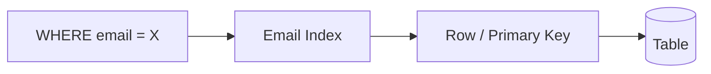

A secondary index is effectively another access path into the same data.

---

# 2.3 The fundamental index trade-off

Indexes make reads faster but writes more expensive.

Suppose you have:

```text
Table
+
5 indexes
```

Every insert may require:

```text
insert table
insert index 1
insert index 2
insert index 3
insert index 4
insert index 5
```

So:

> **An index is a performance optimization for reads that becomes a write and storage liability.**

---

# 2.4 Clustered vs non-clustered indexes

A **clustered index** determines the physical/logical organization of table data around the indexed key.

A conceptual representation:

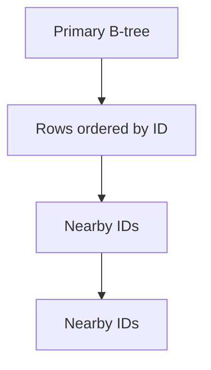

A **non-clustered index** is a separate structure pointing toward table rows.

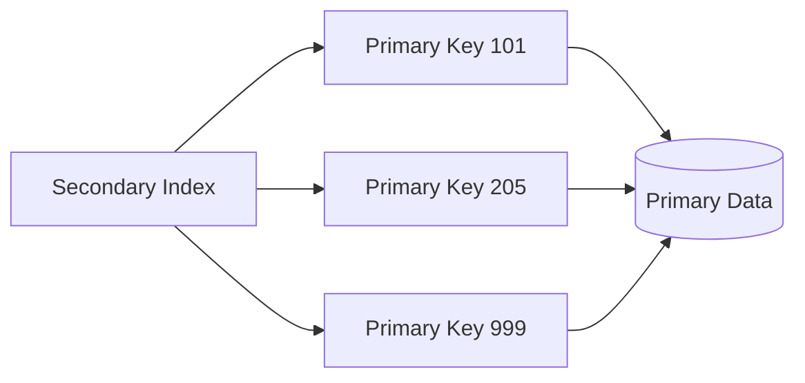

The distinction matters enormously for query performance.

---

# 2.5 Covering indexes

Consider:

```sql
SELECT name
FROM users
WHERE email = 'a@example.com';
```

An index containing:

```text
email -> name
```

can potentially answer the query without fetching the base row.

This is a **covering index**.

Instead of:

```text
Index
 ↓
Table
 ↓
name
```

you get:

```text
Index
 ↓
name
```

This reduces random I/O.

---

# 2.6 Composite indexes

Suppose:

```sql
CREATE INDEX idx
ON orders(customer_id, created_at);
```

This can efficiently support:

```sql
WHERE customer_id = ?
```

and:

```sql
WHERE customer_id = ?
AND created_at > ?
```

But may not efficiently support:

```sql
WHERE created_at > ?
```

This leads to the **leftmost-prefix principle** for many B-tree composite indexes.

Think of the index as sorted by:

```text
customer_id
    ↓
created_at
```

not independently sorted by both fields.

---

# 2.7 B-tree vs Hash vs R-tree

| Index          | Best for                          | Poor for                                  |
| -------------- | --------------------------------- | ----------------------------------------- |
| B-tree         | Equality + ranges + sorting       | Some specialized multidimensional queries |
| Hash           | Exact equality                    | Range/order queries                       |
| R-tree         | Spatial/multidimensional geometry | Ordinary relational lookups               |
| Inverted index | Text/search                       | General transactional lookups             |

---

## Hash indexes

A hash index conceptually does:

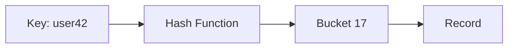

Excellent for:

```sql
WHERE id = 42
```

But poor for:

```sql
WHERE id BETWEEN 40 AND 50
```

because hashing destroys ordering.

---

## R-trees

R-trees are useful for spatial objects:

```text
latitude / longitude
polygons
rectangles
geographic regions
```

Conceptually:

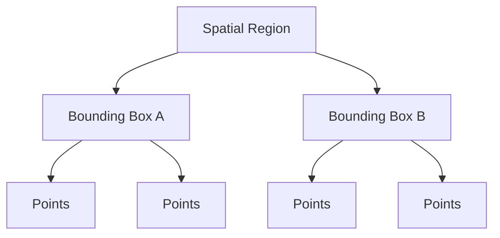

For a query such as:

```text
Find restaurants within 2 km
```

a spatial index can avoid scanning every location.

---

# 2.8 Index pitfalls

### Pitfall 1: Index everything

More indexes mean:

* more storage
* slower writes
* more WAL
* more cache pressure
* more maintenance

### Pitfall 2: Wrong column order

```sql
INDEX(a, b)
```

is not equivalent to:

```sql
INDEX(b, a)
```

### Pitfall 3: Low-selectivity indexes

An index on:

```text
gender
```

may not help much if the table contains only two possible values.

### Pitfall 4: Functions preventing index use

For example:

```sql
WHERE LOWER(email) = 'alice@example.com'
```

may prevent ordinary index usage depending on the database and index definition.

---

# 3. Transaction Processing

Transactions solve a fundamental problem:

> Multiple operations must appear to happen safely despite concurrency, failures, and partial execution.

Consider transferring ₹100:

```text
Account A: -100
Account B: +100
```

If the database crashes after only the first operation, money disappears.

Transactions provide the abstraction that these operations behave as one logical unit.

---

# 3.1 ACID

## Atomicity

All operations happen, or none happen.

```text
A - 100
B + 100
```

must not produce:

```text
A - 100
B unchanged
```

---

## Consistency

Transactions preserve database invariants.

For example:

```text
balance >= 0
```

or:

```text
foreign key must reference existing row
```

Important nuance:

> The database's notion of consistency is about preserving defined invariants; it does not automatically understand your application's business semantics.

---

## Isolation

Concurrent transactions should not improperly interfere with one another.

Example:

```text
T1: update balance
T2: read balance
```

Isolation determines what T2 can observe.

---

## Durability

After commit, data survives failures.

Conceptually:

```text
COMMIT
  ↓
durable WAL
  ↓
acknowledge client
```

Not:

```text
COMMIT
  ↓
keep everything only in RAM
  ↓
tell client "done"
```

---

# 3.2 Isolation levels

A useful progression:

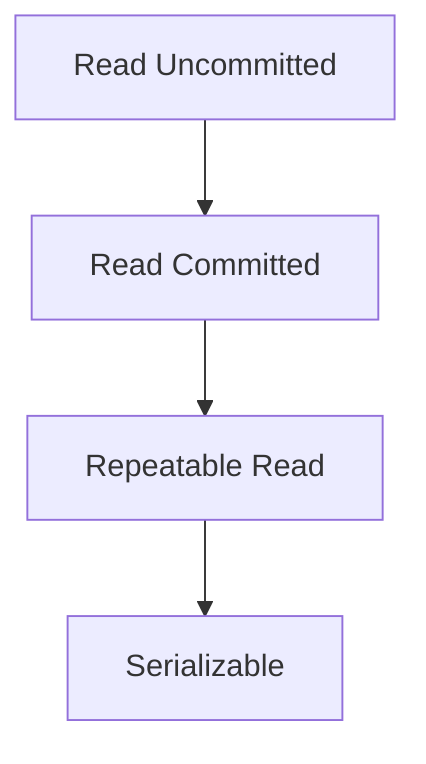

Generally, moving toward serializable gives stronger guarantees at the cost of concurrency/coordination.

---

# 3.3 Dirty reads

Transaction T1:

```text
T1 writes X = 100
```

T2:

```text
T2 reads X = 100
```

Then T1 rolls back.

T2 observed data that never actually committed.

That's a **dirty read**.

---

# 3.4 Non-repeatable reads

T1:

```text
SELECT balance
→ 100
```

T2 modifies it:

```text
balance = 200
COMMIT
```

T1 repeats:

```text
SELECT balance
→ 200
```

The same query produced different results within T1.

---

# 3.5 Phantom reads

T1:

```sql
SELECT *
FROM orders
WHERE amount > 100;
```

T2 inserts a matching row.

T1 executes the query again and sees an additional row.

That new row is a **phantom**.

---

# 3.6 Serializable isolation

The strongest commonly discussed isolation model is:

> The result should be equivalent to some serial execution of the transactions.

Suppose:

```text
T1
T2
T3
```

run concurrently.

Serializable execution must be equivalent to some ordering such as:

```text
T2 → T1 → T3
```

even if internally they overlapped.

---

# 4. Concurrency Control

There are three major ideas to understand:

* locking
* MVCC
* optimistic concurrency

---

# 4.1 Pessimistic locking

The database assumes conflicts are likely.

So it locks data before modifying it.

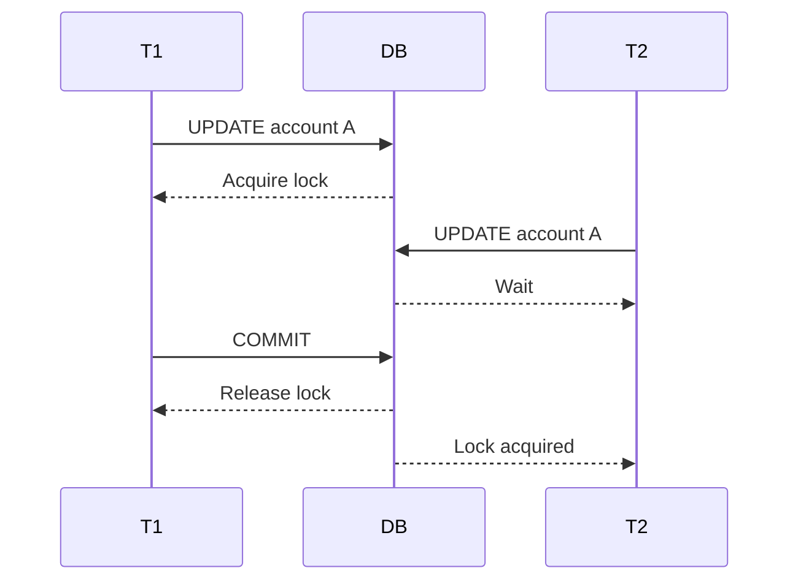

This is conceptually simple.

But locks introduce:

* contention
* blocking
* deadlocks
* reduced concurrency

---

# 4.2 Shared and exclusive locks

A **shared lock** generally allows multiple readers.

```text
Reader 1 ─┐
Reader 2 ─┼── shared lock
Reader 3 ─┘
```

An **exclusive lock** prevents conflicting access:

```text
Writer
  ↓
exclusive lock
  ↓
everyone else waits
```

---

# 4.3 Deadlocks

Consider:

```text
T1 locks A
T2 locks B

T1 waits for B
T2 waits for A
```

Graphically:

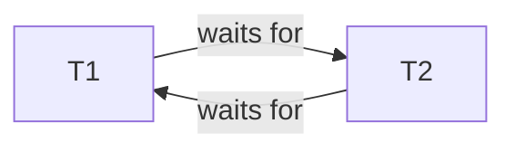

That's a cycle.

The database must detect or prevent it.

A common strategy is:

> Detect the cycle and abort one transaction.

---

# 4.4 MVCC

**Multi-Version Concurrency Control** keeps multiple versions of records.

Instead of:

```text
row = 100
```

think:

```text
version 1: 100
version 2: 150
version 3: 200
```

Each transaction sees an appropriate version based on its snapshot.

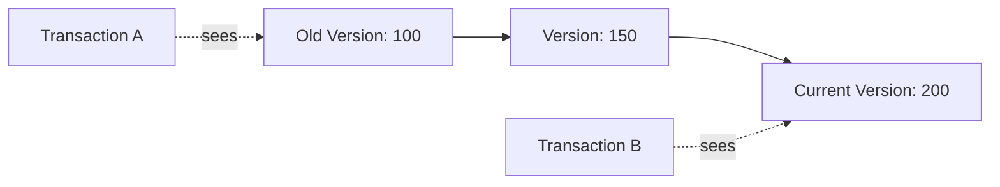

This can dramatically reduce reader/writer blocking.

---

# 4.5 MVCC trade-offs

Advantages:

* readers don't necessarily block writers
* writers don't necessarily block readers
* excellent concurrency

Costs:

* old versions must eventually be reclaimed
* storage overhead
* garbage collection/vacuum
* more complex visibility rules

This is why long-running transactions can be dangerous.

Imagine:

```text
Transaction T starts
       ↓
keeps old snapshot alive
       ↓
millions of updates happen
       ↓
old versions cannot be reclaimed
```

Now your database accumulates garbage.

---

# 4.6 Optimistic concurrency

Optimistic concurrency assumes conflicts are relatively rare.

A classic approach:

```sql
UPDATE accounts
SET balance = 900,
    version = version + 1
WHERE id = 42
  AND version = 17;
```

If zero rows are affected:

```text
Someone else modified the row.
```

Retry or reject.

This is essentially:

```text
Read
 ↓
Compute
 ↓
Validate
 ↓
Commit if still valid
```

---

# 4.7 Optimistic vs pessimistic

|                   | Optimistic     | Pessimistic               |
| ----------------- | -------------- | ------------------------- |
| Assumption        | Conflicts rare | Conflicts possible        |
| Blocking          | Low            | Higher                    |
| Conflict handling | Retry/abort    | Wait                      |
| Good for          | Low contention | High contention           |
| Failure mode      | Retry storms   | Lock contention/deadlocks |

---

# 5. Write-Ahead Logging

WAL is one of the most important concepts in database reliability.

The fundamental rule is:

> **Before modifying durable database pages, persist the information necessary to redo or recover the modification.**

Conceptually:

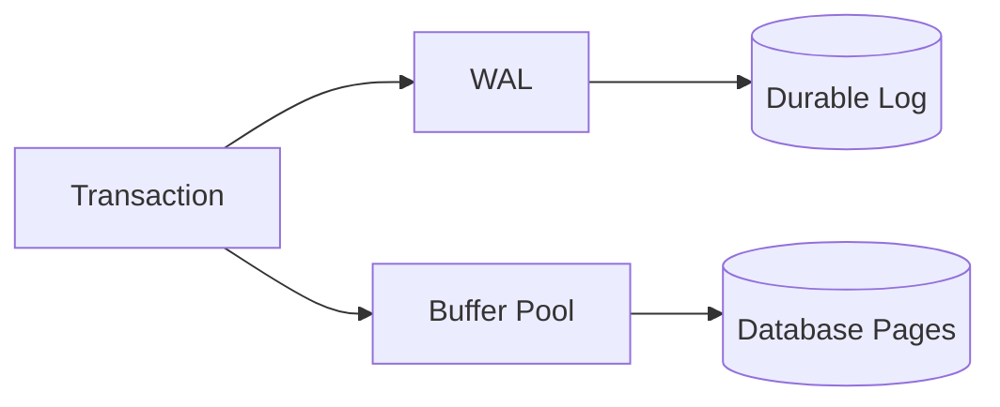

The key ordering is:

```text
WAL durable
    ↓
data page may be flushed
```

not:

```text
data page flushed
    ↓
WAL written later
```

---

# 5.1 Why WAL exists

Suppose:

```text
Disk page:
balance = 100
```

Transaction changes it:

```text
balance = 50
```

RAM:

```text
50
```

Disk:

```text
100
```

If the process crashes before the page reaches disk, that's fine **if the WAL contains the change**.

Recovery can replay it.

---

# 5.2 WAL records

Conceptually:

```text
LSN 100:
transaction=42
page=17
old=100
new=50
```

The **LSN**, or Log Sequence Number, identifies a position in the log.

The page may remember something like:

```text
pageLSN = 100
```

which helps determine whether the corresponding log record has already been applied.

---

# 5.3 Commit

A simplified commit flow:

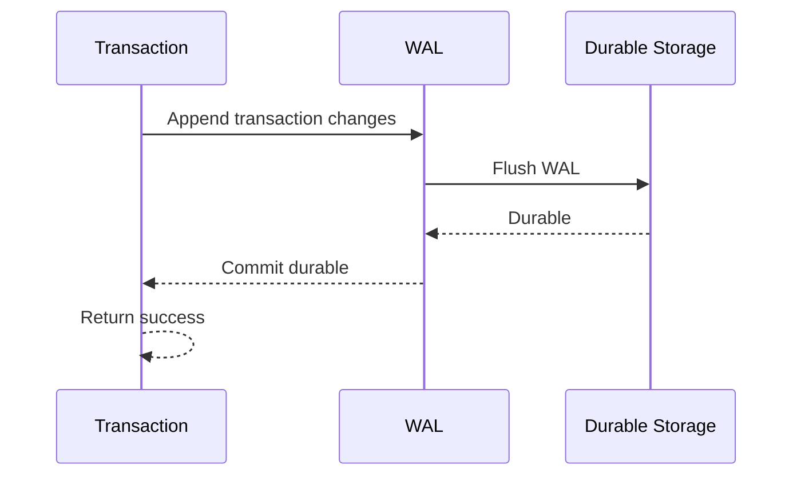

The important point:

> **A commit acknowledgment generally requires the relevant durability guarantee to have been established.**

Exact behavior varies by database and durability configuration.

---

# 5.4 Checkpoints

If the database has been running for days, replaying the entire WAL from the beginning would be expensive.

Therefore databases create **checkpoints**.

Conceptually:


A checkpoint establishes a recovery boundary.

Instead of:

```text
replay 10 TB WAL
```

the database can often begin recovery from a much more recent point.

---

# 5.5 Crash recovery

A simplified recovery process looks like:

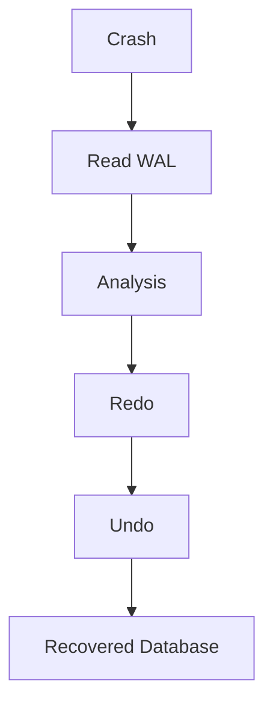

Different databases implement this differently, but the conceptual phases are useful.

---

## Analysis

Determine:

* what transactions were active
* what pages may have outstanding changes
* where recovery should begin

---

## Redo

Replay changes that need to exist.

```text
WAL says:
X changed 10 → 20

Disk says:
X = 10

Redo:
X = 20
```

---

## Undo

Transactions that were incomplete at crash time must be rolled back.

```text
T1:
change A
change B
change C
CRASH
```

If T1 never committed, recovery must ensure its effects don't remain visible as committed state.

---

# 5.6 ARIES

One influential family of recovery algorithms is **ARIES**:

> Algorithms for Recovery and Isolation Exploiting Semantics.

Its key ideas include:

* WAL
* LSNs
* repeating history during redo
* undoing incomplete transactions
* compensation log records

The important distributed-systems lesson isn't memorizing ARIES internals.

It's understanding:

> **The database deliberately separates logical transaction state from physical page flushing so that crashes can be repaired deterministically.**

---

# 5.7 Common WAL misconception

A common misconception is:

> "If the database has a WAL, writes are safe."

Not necessarily.

You need to distinguish:

```text
WAL exists
```

from:

```text
WAL is durably persisted
```

For example, an OS/filesystem/device may buffer writes.

The exact durability semantics depend on:

* database configuration
* filesystem
* storage device
* fsync/barrier behavior
* replication policy

---

# 6. Replication

Replication means maintaining multiple copies of database state.

Why?

* availability
* fault tolerance
* read scaling
* geographic distribution
* disaster recovery

Without replication:

```mermaid
flowchart LR
    App --> DB[(Single Database)]
```

With replication:

```mermaid
flowchart LR
    App --> L[(Leader)]
    L --> R1[(Replica 1)]
    L --> R2[(Replica 2)]
    L --> R3[(Replica 3)]
```

Now you have a new problem:

> **How do these copies agree on the order and visibility of writes?**

---

# 6.1 Leader-based replication

One node acts as the leader.

```mermaid
flowchart TB
    C[Clients] --> L[Leader]

    L --> R1[Replica 1]
    L --> R2[Replica 2]
    L --> R3[Replica 3]
```

Writes go through the leader.

The leader replicates them.

Advantages:

* simple write ordering
* easier conflict resolution
* straightforward transactional semantics

Costs:

* leader bottleneck
* failover complexity
* leader availability becomes critical

---

# 6.2 Synchronous replication

Leader waits for replicas.

```text
Client
 ↓
Leader
 ├── Replica A
 └── Replica B
       ↓
ack
```

This improves durability but increases latency.

If a replica is unavailable:

```text
write latency ↑
```

or the system may become unavailable.

---

# 6.3 Asynchronous replication

Leader acknowledges before replicas necessarily persist the write.

```text
Client
 ↓
Leader
 ↓
ACK

later:
Leader → Replica
```

Lower latency.

But if the leader dies before replication:

```text
committed on leader
not present on replica
```

Potential data loss can occur during failover.

---

# 6.4 Replication lag

Suppose:

```text
Leader LSN = 1,000,000
Replica LSN = 999,000
```

The replica is behind.

This creates subtle application bugs.

Example:

```text
POST /user
    ↓
write leader
    ↓
GET /user
    ↓
read replica
    ↓
404
```

The write succeeded, but the subsequent read hit a replica that hasn't caught up.

This is a classic **read-your-writes** problem.

---

# 7. Leaderless Replication

Leaderless systems allow clients to interact with multiple replicas.

A simplified model:

```mermaid
flowchart TB
    C[Client] --> R1[Replica 1]
    C --> R2[Replica 2]
    C --> R3[Replica 3]

    R1 <--> R2
    R2 <--> R3
    R1 <--> R3
```

Writes may be sent to several replicas.

This often uses **quorums**.

---

# 7.1 Quorum

Suppose:

```text
N = 3 replicas
```

A write might require:

```text
W = 2 acknowledgments
```

A read might require:

```text
R = 2 responses
```

Then:

```text
W + R > N
```

because:

```text
2 + 2 > 3
```

Therefore the read and write sets overlap.

---

# 7.2 Why quorum overlap matters

Suppose write:

```text
x = 100
```

reaches:

```text
R1
R2
```

Read contacts:

```text
R2
R3
```

R2 has the new value.

Thus the reader can discover the latest version.

But don't oversimplify this:

> **Quorum intersection alone does not automatically give linearizability.**

You also need appropriate versioning, conflict resolution, failure handling, read/write protocols, and timing assumptions.

---

# 7.3 Version vectors

Leaderless systems may need to determine whether one value supersedes another.

For example:

```text
A:
x = 10
version = [2,1]

B:
x = 20
version = [1,3]
```

Neither necessarily dominates the other.

These can represent **concurrent writes**.

The system may need:

* conflict resolution
* application-level merging
* last-write-wins
* CRDTs
* deterministic reconciliation

---

# 8. Consistency Models

"Consistency" is overloaded.

For distributed systems, you need to ask:

> **What exactly can a client observe?**

---

# 8.1 Linearizability

Linearizability provides a very strong guarantee:

> Each operation appears to happen atomically at some point between its invocation and response, while respecting real-time ordering.

Suppose:

```text
T1:
write x = 10
returns

T2:
read x
```

If T2 starts after T1's successful response, T2 must see:

```text
x = 10
```

under a linearizable model.

---

# 8.2 Sequential consistency

Sequential consistency requires operations to appear in a single order consistent with each client's program order.

It does not necessarily preserve real-time ordering between clients in the same way linearizability does.

This distinction matters in distributed systems.

---

# 8.3 Eventual consistency

Eventual consistency says roughly:

> If updates stop, replicas eventually converge.

Imagine:

```mermaid
flowchart LR
    W[Write x=10] --> A[Replica A]
    W --> B[Replica B]

    A -->|immediately| RA[Read: 10]
    B -->|temporarily| RB[Read: old value]

    B -->|replication| C[Converged State]
    A --> C
```

This provides much weaker immediate guarantees but can offer:

* high availability
* low latency
* geographical distribution
* tolerance of network partitions

---

# 8.4 Read-your-writes consistency

A particularly useful application guarantee:

> After I successfully write something, my subsequent reads should see that write.

Example:

```text
POST /profile
    ↓
success

GET /profile
    ↓
must see new profile
```

This is weaker than global linearizability but much stronger than arbitrary eventual consistency.

---

# 8.5 Monotonic reads

If you've observed version 10, you shouldn't subsequently see version 9.

```text
Read 1 → version 10
Read 2 → version 10
Read 3 → version 11
```

not:

```text
Read 1 → version 10
Read 2 → version 8
```

This is another useful consistency guarantee for applications.

---

# 9. CAP: Useful but Commonly Misunderstood

CAP says that during a **network partition**, a distributed system cannot simultaneously guarantee both:

* strong consistency
* availability

while also tolerating that partition.

```mermaid
flowchart TB
    P[Network Partition]
    P --> C[Strong Consistency]
    P --> A[Availability]

    C -. cannot simultaneously guarantee both .-> A
```

This doesn't mean:

> "You can only choose two of consistency, availability, partition tolerance."

Partitions are unavoidable in distributed systems, so the practical question is:

> **When a partition occurs, do you sacrifice availability or consistency?**

---

# 10. Putting the Pieces Together

A modern transactional database might process a write like this:

```mermaid
sequenceDiagram
    participant App
    participant DB as Database
    participant Lock as Concurrency Control
    participant WAL
    participant BP as Buffer Pool
    participant Disk
    participant R as Replica

    App->>DB: UPDATE
    DB->>Lock: Acquire/validate
    Lock-->>DB: Allowed
    DB->>WAL: Append log record
    WAL->>Disk: Durable WAL
    DB->>BP: Modify page
    DB->>R: Replicate
    R-->>DB: Replica acknowledgment
    DB-->>App: COMMIT
```

The exact sequence differs by database, but the major concerns are always present:

```text
Concurrency
    ↓
Durability
    ↓
Storage
    ↓
Replication
    ↓
Failure recovery
```

---

# 11. Performance: What Actually Matters?

As a distributed-systems engineer, avoid thinking:

> "Database performance = query execution time."

It's much broader.

A useful decomposition is:

```mermaid
flowchart LR
    L[Application Latency]
    L --> CPU[CPU]
    L --> MEM[Memory]
    L --> IO[I/O]
    L --> LOCK[Lock / MVCC Contention]
    L --> NET[Network]
    L --> REPL[Replication]
    L --> QUEUE[Queueing]
```

---

## 11.1 CPU

Expensive:

* sorting
* joins
* expression evaluation
* serialization
* compression
* encryption

---

## 11.2 Memory

Memory determines:

* buffer-pool hit rate
* index residency
* cache efficiency
* sorting capacity
* working-set size

A database with enough RAM to keep its hot working set in memory can behave radically differently from one constantly doing disk I/O.

---

## 11.3 I/O

Random I/O is often substantially more expensive than sequential I/O.

This explains many database design choices:

```text
B-tree → optimize page locality
LSM → turn random writes into sequential writes
WAL → sequential durable log
```

---

## 11.4 Contention

Your query may be computationally cheap but still slow because:

```text
waiting for lock
waiting for transaction
waiting for replication
waiting for disk
waiting for connection
```

Always distinguish:

> **CPU time vs wait time.**

---

# 12. Write Amplification, Read Amplification, Space Amplification

These three concepts are extremely useful when evaluating storage engines.

## Write amplification

Logical write:

```text
1 KB
```

Physical writes:

```text
10 KB
```

Ratio:

```text
10x
```

---

## Read amplification

One logical lookup requires:

```text
5 physical reads
```

---

## Space amplification

Logical data:

```text
100 GB
```

Physical storage:

```text
160 GB
```

due to:

* indexes
* obsolete versions
* compaction
* metadata
* replication
* free space

A storage engine is essentially balancing these three costs.

---

# 13. Common Developer Pitfalls

## 13.1 Long transactions

Bad:

```text
BEGIN

read
call external API
wait 10 seconds
do work
COMMIT
```

This can hold:

* locks
* snapshots
* resources

for far too long.

Better:

```text
do external work first

BEGIN
perform DB operations
COMMIT
```

where correctness allows.

---

## 13.2 Assuming `COMMIT` means globally replicated

These are different:

```text
locally durable
```

vs:

```text
replicated to quorum
```

vs:

```text
replicated to every region
```

Always understand the actual durability contract.

---

## 13.3 Assuming replicas are immediately consistent

Bad architecture:

```text
write → leader
read → arbitrary replica
```

if the application assumes read-after-write semantics.

Solutions include:

* leader reads
* session affinity
* causal/session consistency
* replication-aware routing
* waiting for a replica position

---

## 13.4 Too many indexes

Every index has a cost.

Before adding one, ask:

```text
Which query does this accelerate?
How selective is it?
How often does that query run?
What does it cost to maintain?
```

---

## 13.5 Ignoring cardinality

An index is useful when it meaningfully narrows the search.

Compare:

```text
country = 'US'
```

versus:

```text
user_id = 829374982
```

The second usually has much higher selectivity.

---

## 13.6 Offset pagination

This can become expensive:

```sql
SELECT *
FROM orders
ORDER BY id
LIMIT 100 OFFSET 10000000;
```

The database may need to walk past huge numbers of rows.

Prefer **keyset/cursor pagination**:

```sql
SELECT *
FROM orders
WHERE id > :last_seen_id
ORDER BY id
LIMIT 100;
```

This maps naturally onto ordered indexes.

---

## 13.7 N+1 queries

Application:

```text
query users
 ↓
query orders for user 1
query orders for user 2
query orders for user 3
...
```

One logical operation becomes thousands of database round trips.

The network is often the real bottleneck.

---

## 13.8 Hot keys

Distributed databases can still suffer from centralized contention.

Example:

```text
counter:global
```

Every write targets one key.

Even with 100 machines:

```text
100 machines
      ↓
one hot key
```

You have effectively created a bottleneck.

Solutions may involve:

* sharding
* key spreading
* local aggregation
* batching
* partitioned counters

---

# 14. Distributed-Systems Engineer's Design Checklist

When evaluating a database, ask these questions.

### Storage

* B-tree or LSM?
* What is the page size?
* How does the buffer pool work?
* What causes compaction?
* What's the expected write amplification?
* What's the worst-case read amplification?

### Indexing

* What indexes exist?
* Which are clustered?
* What is the composite-key ordering?
* Are covering indexes available?
* What happens to indexes during writes?

### Transactions

* What isolation level is default?
* Is it MVCC?
* What locks exist?
* How are deadlocks handled?
* What causes transaction aborts?

### Durability

* Is WAL used?
* When is WAL considered durable?
* Does commit require `fsync`?
* What does the storage stack guarantee?
* How long does crash recovery take?

### Replication

* Leader or leaderless?
* Synchronous or asynchronous?
* How is leader election performed?
* What happens during a partition?
* How is replication lag exposed?
* Can acknowledged writes be lost?

### Consistency

Don't simply ask:

> "Is this database strongly consistent?"

Ask:

```text
Are writes linearizable?
Are reads linearizable?
Are transactions serializable?
Are replica reads stale?
Do clients get read-your-writes?
What happens after failover?
```

Those are much more useful questions.

---

# 15. Representative Database Architectures

There is no universal "best" database architecture.

Different systems optimize different dimensions.

| Architecture           | Typical Storage                   | Indexing                              | Transactions                            | Replication          | Strengths                                  | Trade-offs                                 |
| ---------------------- | --------------------------------- | ------------------------------------- | --------------------------------------- | -------------------- | ------------------------------------------ | ------------------------------------------ |
| Traditional relational | B-tree / variants                 | Rich B-tree indexes                   | Strong ACID                             | Usually leader-based | Transactions, joins, mature ecosystem      | Horizontal scaling can be difficult        |
| Distributed relational | B-tree / distributed storage      | Rich indexes                          | Strong / serializable variants          | Consensus-based      | SQL + horizontal scalability               | Coordination and latency                   |
| LSM NoSQL              | LSM + SSTables                    | Key-oriented / secondary indexes vary | Often limited or specialized            | Leader or leaderless | Very high write throughput                 | Compaction/read amplification              |
| Document database      | B-tree or LSM depending on engine | Document/field indexes                | Varies                                  | Usually replicated   | Flexible schemas, developer ergonomics     | Complex relational queries may be weaker   |
| Wide-column            | LSM commonly                      | Partition/clustering-key structures   | Often partition-scoped                  | Distributed          | Massive scale, predictable access patterns | Query model requires careful data modeling |
| Distributed KV         | LSM/B-tree variants               | Key-based                             | Often limited or transactional variants | Consensus or quorum  | Simple scalable primitives                 | Application manages more semantics         |
| In-memory database     | Memory + persistence/WAL          | Hash/B-tree/specialized               | Varies                                  | Varies               | Extremely low latency                      | Memory cost and durability complexity      |

---

# 16. Relational vs NoSQL vs NewSQL

A useful conceptual distinction:

### Relational

Optimizes:

```text
rich query language
+
transactions
+
constraints
+
joins
```

Example architecture:

```mermaid
flowchart LR
    SQL[SQL] --> OPT[Query Optimizer]
    OPT --> IDX[Indexes]
    IDX --> BP[Buffer Pool]
    BP --> BT[B-tree Storage]
    TX[Transaction Manager] --> WAL[WAL]
```

---

### NoSQL

"NoSQL" isn't one architecture.

It generally represents systems that make deliberate trade-offs around:

* schema flexibility
* horizontal scalability
* query model
* consistency
* availability

A common pattern:

```mermaid
flowchart LR
    API[Application] --> P[Partitioner]
    P --> N1[Node 1]
    P --> N2[Node 2]
    P --> N3[Node 3]

    N1 --> S1[(Local Storage)]
    N2 --> S2[(Local Storage)]
    N3 --> S3[(Local Storage)]
```

The application often needs to understand the access pattern much more explicitly.

---

### NewSQL / distributed SQL

The goal is roughly:

> **Relational semantics + distributed scalability.**

Conceptually:

```mermaid
flowchart TB
    SQL[SQL Client]
    SQL --> Q[Distributed Query Layer]
    Q --> C[Distributed Transaction Layer]
    C --> CP[Consensus / Replication]
    CP --> P1[Partition 1]
    CP --> P2[Partition 2]
    CP --> P3[Partition 3]

    P1 --> S1[(Storage)]
    P2 --> S2[(Storage)]
    P3 --> S3[(Storage)]
```

The challenge is that distributed transactions require coordination.

Coordination costs:

```text
network latency
+
failure handling
+
consensus
+
distributed deadlock/conflict handling
```

So you don't get horizontal scalability for free.

---

# 17. The Big Picture

The most useful mental model is to connect all these concepts.

```mermaid
flowchart TB
    APP[Application]

    APP --> TX[Transaction]
    TX --> CC[Concurrency Control]
    TX --> WAL[Write-Ahead Log]
    TX --> BP[Buffer Pool]

    CC --> MVCC[MVCC / Locks]

    BP --> SE[Storage Engine]

    SE --> BT[B-tree]
    SE --> LSM[LSM Tree]

    BT --> IDX[Index Pages]
    LSM --> SST[SSTables]

    WAL --> REC[Crash Recovery]
    REC --> CK[Checkpoints]

    TX --> REPL[Replication]
    REPL --> CONS[Consistency Model]

    CONS --> LIN[Linearizability]
    CONS --> EVT[Eventual Consistency]
```

And the entire database can be understood as four cooperating mechanisms:

### 1. Storage

> **Where does the data physically live?**

B-trees, LSM trees, pages, SSTables, buffer pools.

### 2. Concurrency

> **What happens when many operations occur simultaneously?**

Locks, MVCC, optimistic concurrency, isolation levels.

### 3. Recovery

> **What happens when the machine crashes halfway through an operation?**

WAL, checkpoints, redo, undo.

### 4. Distribution

> **What happens when the data exists on multiple machines?**

Replication, consensus, quorums, consistency models, partitions.

---

# 18. The Most Important Mental Models to Retain

If you remember only a few things, remember these:

### **1. RAM is a cache; durable storage is the source of truth.**

The buffer pool exists because storage is expensive.

### **2. B-trees optimize organized random access.**

They are excellent when you need:

```text
point lookup
+
range lookup
+
ordered traversal
```

### **3. LSM trees trade read/space/compaction complexity for excellent write throughput.**

Think:

```text
write → accumulate → flush → merge
```

### **4. An index is a second data structure that must itself be maintained.**

Every index improves some reads while imposing:

```text
storage + write + cache + maintenance
```

costs.

### **5. Transactions are about coordinating concurrent state transitions.**

ACID isn't magic; it is implemented through:

```text
logging
+
concurrency control
+
isolation
+
recovery
```

### **6. WAL separates durability from page flushing.**

The database doesn't need every modified page immediately on disk.

It needs enough durable information to reconstruct correct state after failure.

### **7. Replication introduces a second axis of correctness.**

A transaction can be:

```text
locally committed
```

while still not being:

```text
globally replicated
```

### **8. "Consistency" is not one thing.**

Distinguish:

```text
linearizability
serializability
sequential consistency
read-your-writes
causal consistency
eventual consistency
```

### **9. Distributed databases exchange local simplicity for coordination.**

When you distribute state, you introduce:

```text
network failures
+
partitions
+
replication lag
+
consensus
+
coordination latency
+
failure detection
```

### **10. Database performance is usually about trade-offs, not individual data structures.**

Ultimately you're balancing:

```text
                    ┌── Read amplification
                    ├── Write amplification
                    ├── Space amplification
                    ├── CPU
Database behavior ──┼── Memory
                    ├── Disk I/O
                    ├── Contention
                    ├── Network latency
                    └── Coordination
```

For a distributed-systems engineer, this last model is especially important: **database architecture is fundamentally the engineering of state, durability, concurrency, and failure under resource constraints.**
