# Kafka & Messaging Systems at Scale — A Staff-Engineer Guide

Kafka is easiest to understand if you stop thinking of it as “a queue” and instead think of it as a **distributed, replicated, append-only log with a network protocol and consumer coordination layered around it**.

That distinction drives almost every important design decision: partitioning, ordering, replication, consumer groups, retention, replay, exactly-once processing, and operational behavior.

---

# 1. Core Architecture and Concepts

## 1.1 The mental model

Imagine a giant distributed journal.

* A **topic** is a named journal.
* A **partition** is one independently appendable journal within that topic.
* A **producer** writes records to a partition.
* A **consumer** reads records sequentially.
* A **consumer group** is a team of consumers dividing partitions among themselves.
* A **broker** stores partitions and serves reads/writes.
* Replicas provide redundant copies of partitions.
* An **offset** is the position of a record within a partition.

For example:

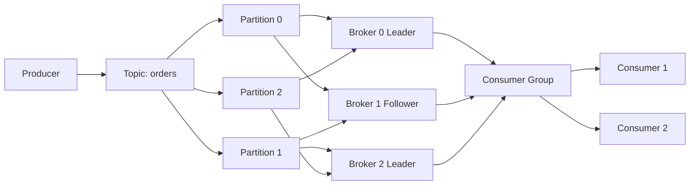

A critical point:

> **Kafka scales primarily by adding partitions, not by making one partition faster.**

A topic with 1 partition is fundamentally limited to the throughput and ordering characteristics of that partition.

---

# 2. Key Kafka Terminology

| Term               | Meaning                                | Staff-level intuition                         |
| ------------------ | -------------------------------------- | --------------------------------------------- |
| Topic              | Logical stream of records              | Database table / event stream                 |
| Partition          | Ordered append-only log                | One shard of the stream                       |
| Offset             | Position in a partition                | Log sequence number                           |
| Broker             | Kafka server                           | Storage + network worker                      |
| Leader             | Replica accepting writes/serving reads | Primary for a partition                       |
| Follower           | Replica copying leader                 | Replica                                       |
| ISR                | In-sync replicas                       | Replicas sufficiently caught up to be trusted |
| Replication factor | Number of copies                       | Durability multiplier                         |
| Consumer group     | Consumers sharing work                 | Distributed worker pool                       |
| Consumer lag       | Unprocessed distance from head         | Queue backlog                                 |
| Retention          | How long/large logs remain             | History policy                                |
| Compaction         | Keep latest value per key              | Materialized-state preservation               |
| Coordinator        | Broker managing group coordination     | Group membership manager                      |
| Rebalance          | Redistributing partitions              | Worker ownership reshuffle                    |

### The most important distinction

There are two positions worth keeping in your head:

```text
Log end:
        0 1 2 3 4 5 6 7 8 9
        ↑                 ↑
     consumer           producer
     offset              append
```

If the consumer has processed offset `5` while the producer has reached `9`, approximately four records remain to be processed.

This is **consumer lag**.

---

# 3. Why Kafka Internals Matter

At staff level, don't memorize configuration properties independently.

Understand the causal chain:

```text
Partition count
      ↓
Parallelism
      ↓
Network + disk utilization
      ↓
Throughput
      ↓
Consumer processing capacity
      ↓
Lag
      ↓
Recovery / operational behavior
```

Similarly:

```text
Replication factor
      ↓
Copies of data
      ↓
Durability
      ↓
Network + disk overhead
      ↓
Write latency
      ↓
Recovery time
```

The important engineering question is therefore not:

> “What should `replication.factor` be?”

It is:

> “What failure model and recovery objective does this workload require, and what throughput/latency cost are we willing to pay?”

---

# 4. Storage Internals

## 4.1 Partition = append-only log

Suppose a partition contains:

```text
offset  key    value
------  -----  -----
0       A      ...
1       B      ...
2       C      ...
3       A      ...
4       D      ...
```

Kafka primarily appends:

```text
append(record)
append(record)
append(record)
```

It doesn't normally modify old records in place.

This is fundamentally different from a traditional database page-update model.

### Why append-only?

Sequential appends are extremely efficient.

Instead of:

```text
random disk seek
random disk seek
random disk seek
```

Kafka aims for:

```text
append → append → append → append
```

Modern storage and operating systems can handle sequential workloads very efficiently.

---

# 5. Log Segments

A partition is not one infinite file.

Kafka divides it into **segments**.

Conceptually:

```text
Partition 7

segment 00000000000000000000
    ├── records
    ├── index
    └── time index

segment 00000000000000123456
    ├── records
    ├── index
    └── time index

segment 00000000000000234567
    ├── records
    ├── index
    └── time index
```

The active segment receives new writes.

Older segments become eligible for retention.

This is crucial because deletion can happen at segment granularity rather than requiring individual record deletion.

### Engineering intuition

Think of segments as **logbook volumes**:

> “Volume 1 is full. Start Volume 2.”

When Volume 1 becomes old enough, throw away the entire volume.

That's much cheaper than removing individual lines from a logbook.

---

# 6. File-Backed vs In-Memory State

Kafka does **not** require the entire dataset to fit in RAM.

The durable data lives on disk.

The OS page cache can cache frequently accessed data.

Conceptually:

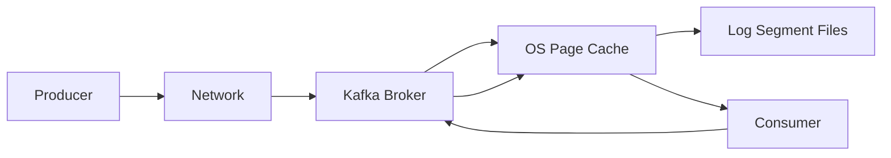

This architecture has an important consequence:

> Kafka benefits heavily from operating-system caching without requiring Kafka itself to implement a massive application-level cache.

Kafka can use mechanisms such as zero-copy transfers to move data efficiently from filesystem cache toward network clients.

---

# 7. Partitioning Strategy

Partitioning is probably the **single most important Kafka design decision**.

Given:

```text
topic = payments
```

you might choose:

```text
payment_id → partition
```

or:

```text
customer_id → partition
```

or perhaps:

```text
random → partition
```

Each choice has consequences.

## Key-based partitioning

Usually:

```text
partition = hash(key) % partition_count
```

Therefore:

```text
customer A → partition 2
customer A → partition 2
customer A → partition 2
```

This provides ordering for that key.

### The trade-off

If one customer generates 50% of your traffic:

```text
P0 ─── 5%
P1 ─── 5%
P2 ─── 5%
P3 ─── 85%  ← hot partition
```

Adding brokers won't necessarily fix this.

The partition itself is the bottleneck.

---

# 8. Ordering Semantics

Kafka guarantees ordering **within a partition**.

It does not provide global ordering across partitions.

For example:

```text
Partition 0:
A1 → A2 → A3

Partition 1:
B1 → B2 → B3
```

There is no meaningful Kafka ordering guarantee between:

```text
A2 and B1
```

### Design implication

If you require:

> “All events for customer X must be processed in order.”

Use:

```text
key = customer_id
```

If you require:

> “Every event in the entire system must be globally ordered.”

You effectively need one ordering domain, often meaning one partition, which sacrifices parallelism.

---

# 9. Retention

Kafka typically retains data based on policies such as:

* time
* total log size

For example:

```text
retain events for 7 days
```

or:

```text
retain until partition exceeds configured size
```

Kafka isn't fundamentally:

> “Delete the message after the consumer reads it.”

This is one of the biggest conceptual differences from traditional queues.

Consumers can read:

```text
offset 100
```

and later another consumer can independently read:

```text
offset 100
```

again.

This enables:

* replay
* backfills
* debugging
* rebuilding derived state
* new consumers
* event-driven architectures

---

# 10. Log Compaction

Deletion retention says:

> “Old records eventually disappear.”

Compaction says:

> “For each key, retain the latest state.”

Suppose:

```text
user-42 → ACTIVE
user-42 → PREMIUM
user-42 → SUSPENDED
```

Compaction can eventually reduce the history to approximately:

```text
user-42 → SUSPENDED
```

It is particularly useful for:

* entity state
* configuration
* caches
* database change streams
* state restoration

### Important distinction

Compaction is **not** an immediate `UPDATE`.

It is an asynchronous storage optimization.

There may temporarily be multiple records for the same key.

---

# 11. Messaging Semantics

There are three common delivery guarantees.

## At-most-once

```text
process
  ↓
commit offset
  ↓
crash
```

The message might never be processed.

Result:

> Possible loss, no duplicates.

Useful when occasional loss is acceptable.

---

## At-least-once

```text
process
  ↓
crash before offset commit
  ↓
restart
  ↓
process again
```

Result:

> No intentional loss, but duplicates are possible.

This is often the practical default.

Therefore consumers should ideally be **idempotent**.

For example:

```text
event_id = 12345
```

and maintain:

```text
processed_events(12345)
```

so replaying event `12345` doesn't produce another business-side effect.

---

# 12. Exactly-Once

Exactly-once is frequently misunderstood.

Kafka can provide stronger exactly-once processing semantics in specific transactional workflows, particularly:

```text
consume Kafka
      ↓
process
      ↓
produce Kafka
```

with Kafka transactions.

Conceptually:

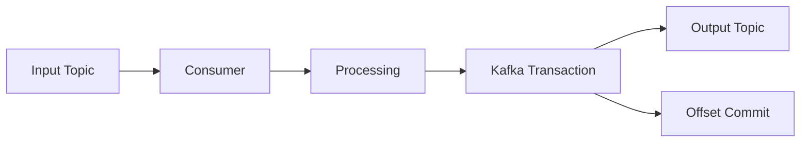

The desired property is:

```text
output records + consumed offsets
```

become part of one atomic transaction.

But exactly-once does **not** magically make arbitrary external side effects exactly once.

Consider:

```text
Kafka
  ↓
Application
  ↓
HTTP API
  ↓
Payment provider
```

A Kafka transaction cannot atomically include an arbitrary external HTTP API.

You need patterns such as:

* idempotency keys
* transactional outbox
* inbox/deduplication
* downstream transactional integration

---

# 13. Producer Internals

A producer doesn't necessarily send:

```text
record
record
record
record
```

individually.

It can batch:

```text
┌─────────────────────────────┐
│ record 1                    │
│ record 2                    │
│ record 3                    │
│ record 4                    │
└─────────────────────────────┘
             ↓
          network
```

This dramatically improves efficiency.

Why?

Because every network request has overhead.

Sending 100 records individually:

```text
100 network operations
```

versus:

```text
1 batch containing 100 records
```

can produce a major throughput improvement.

---

# 14. `batch.size` and `linger.ms`

Two concepts matter:

### `batch.size`

How much data Kafka attempts to accumulate into a batch.

### `linger.ms`

How long the producer is willing to wait for more records before sending a partially filled batch.

Conceptually:

```text
record arrives
    ↓
wait briefly
    ↓
more records arrive?
    ↓
yes → batch
    ↓
send
```

Increasing batching generally gives:

```text
better throughput
better compression
higher potential latency
```

Reducing batching gives:

```text
lower latency
more requests
lower efficiency
```

Staff-level tuning means understanding this curve rather than blindly changing numbers.

---

# 15. Compression

Kafka producers can compress batches.

Common codecs include:

* gzip
* snappy
* lz4
* zstd

Compression can reduce:

```text
network bandwidth
disk usage
I/O
```

but increases:

```text
CPU
```

Batch compression is especially effective because similar records are grouped together.

---

# 16. Producer Durability

The key producer setting is `acks`.

## `acks=0`

Producer doesn't wait for broker acknowledgment.

```text
Producer → broker
          X
      no confirmation
```

Lowest latency, weakest durability.

Potentially lost data.

---

## `acks=1`

Leader acknowledges after accepting the record.

```text
Producer
   ↓
Leader
   ↓
ACK
```

A leader failure before replication can result in loss depending on the failure/election circumstances.

---

## `acks=all`

Leader waits for the required in-sync replicas.

Conceptually:

```text
Producer
   ↓
Leader
  ↙ ↘
 F1  F2
  ↓   ↓
ACK after required replicas confirm
```

Higher durability.

Potentially higher latency.

---

# 17. `min.insync.replicas`

This is an important reliability control.

Suppose:

```text
replication.factor = 3
min.insync.replicas = 2
acks = all
```

You have:

```text
Leader
Follower
Follower
```

If one replica disappears:

```text
Leader
Follower
```

Two replicas remain in ISR, so writes can continue.

If another disappears:

```text
Leader only
```

The broker should reject `acks=all` writes because the configured minimum ISR cannot be satisfied.

That gives you:

> **availability sacrificed in order to preserve a durability guarantee.**

This is often exactly what you want for important data.

---

# 18. Replication

Each partition has:

```text
Leader
  ├── Follower
  └── Follower
```

The leader is responsible for coordinating writes.

Followers replicate the leader's log.

Example:

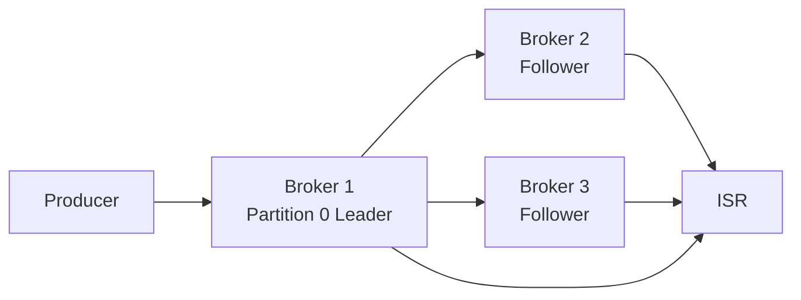

Kafka tracks which replicas are sufficiently caught up as **ISR**.

---

# 19. Why ISR Exists

Suppose:

```text
Broker 1 = leader
Broker 2 = follower
Broker 3 = follower
```

But Broker 3 has been offline for an hour.

You don't want to casually say:

> “Broker 3 is a valid copy, elect it leader.”

Its data may be far behind.

So Kafka distinguishes:

```text
replicas
```

from:

```text
in-sync replicas
```

This is fundamentally a durability mechanism.

---

# 20. Leader Election

If a partition leader fails:

```text
Before:

P0
 |
Broker A ← Leader
Broker B ← Follower
Broker C ← Follower
```

The controller/metadata quorum coordinates a new leader:

```text
After:

P0
 |
Broker B ← New Leader
Broker A ← Failed
Broker C ← Follower
```

The preferred choice is generally an eligible sufficiently caught-up replica rather than an arbitrarily stale copy.

---

# 21. ZooKeeper vs KRaft

Historically Kafka used **ZooKeeper** for metadata and controller coordination.

Modern Kafka uses **KRaft**, Kafka's Raft-based metadata quorum architecture.

### Historical architecture

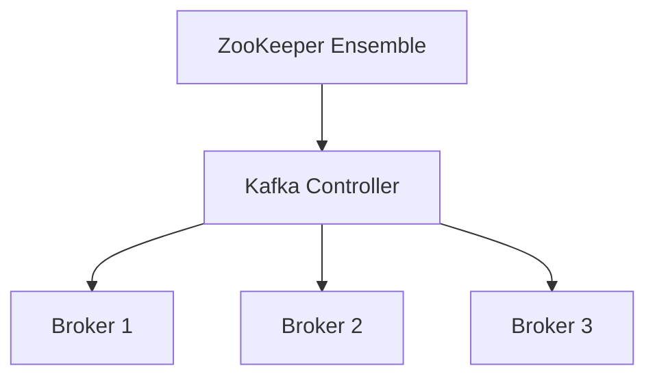

### KRaft

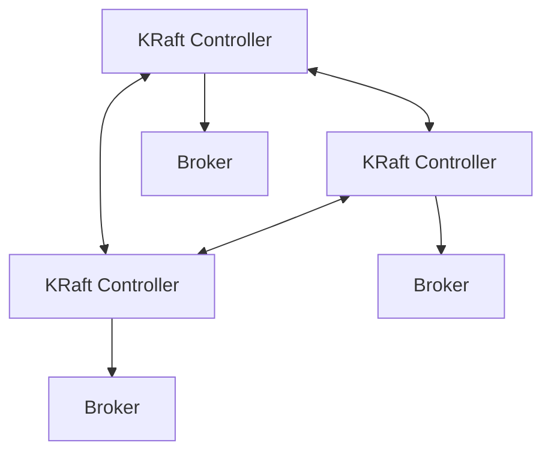

The important conceptual improvement:

> Kafka's metadata state is itself managed through a Raft quorum rather than depending on an external ZooKeeper cluster.

For new deployments, KRaft is the modern architectural model.

---

# 22. Consensus vs Data Replication

Don't confuse these two.

### Metadata consensus

KRaft/Raft manages things such as cluster metadata and controller state.

### Partition replication

Partition leaders and followers replicate actual topic data.

Conceptually:

```text
KRaft quorum
     │
     │ manages metadata
     ↓
Partition leadership
     │
     │
     ↓
Leader → Followers
     actual data replication
```

They solve related but different problems.

---

# 23. Crash Recovery

Imagine a broker crashes while writing.

Kafka has:

```text
segment files
indexes
replication state
```

On restart, it needs to determine the valid log state.

Conceptually:

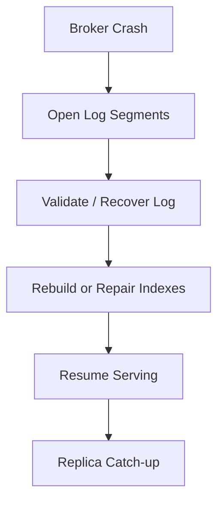

The append-only architecture helps recovery because the system primarily needs to reason about log position and valid appended records rather than reconstructing arbitrary in-place mutations.

---

# 24. Failure Scenarios

## Broker failure

```text
Broker A fails
     ↓
Partitions led by A lose leadership
     ↓
Eligible replicas become leaders
     ↓
Consumers/producers reconnect
```

Possible impact:

* temporary latency spike
* leader-election events
* client retries
* under-replicated partitions

---

## Network partition

More subtle.

Suppose:

```text
Broker A  ←→  Broker B
```

and connectivity breaks.

Kafka must avoid having conflicting leaders accepting writes independently.

This is why controller/metadata coordination and ISR rules matter.

The core distributed-systems problem is:

> **Who is allowed to believe they are leader?**

---

# 25. Split Brain

A dangerous distributed-system failure is:

```text
Client
  ↓
Node A believes it is leader

Client
  ↓
Node B also believes it is leader
```

Now both accept writes.

That can cause divergent histories.

Kafka's leadership/metadata architecture is designed to avoid this through coordinated controller and replica state.

As a staff engineer, this is the deeper principle to remember:

> **Leader election is fundamentally about establishing exclusive authority, not simply picking a server.**

---

# 26. Consumer Groups

Suppose:

```text
Topic
 ├── P0
 ├── P1
 ├── P2
 └── P3
```

and:

```text
Consumer Group
 ├── C1
 ├── C2
 └── C3
```

Partitions are distributed across consumers.

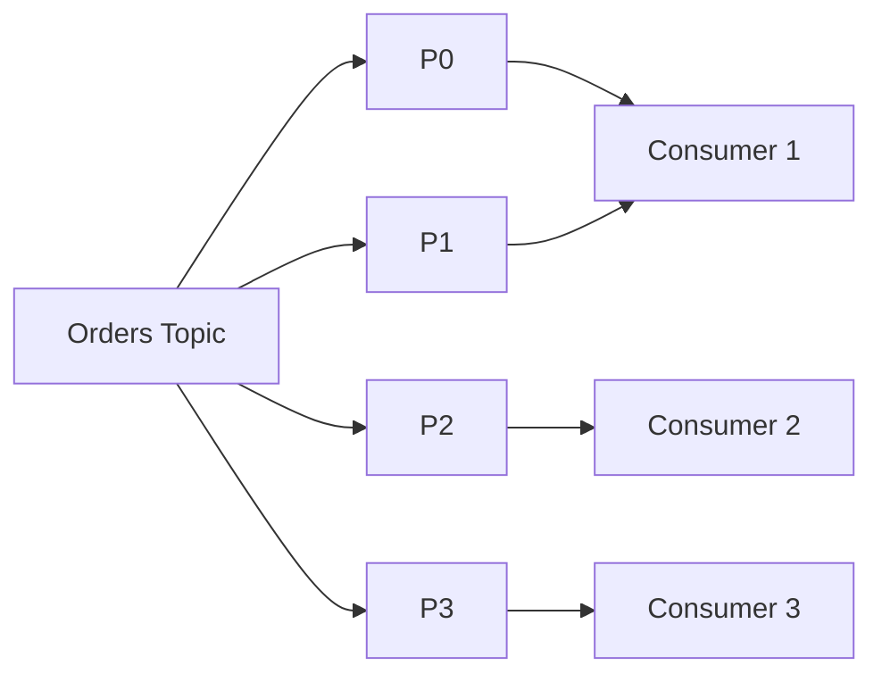

One consumer can own multiple partitions.

But, broadly:

> **A partition is processed by at most one active consumer within a consumer group at a time.**

---

# 27. Scaling Consumers

Suppose:

```text
10 partitions
```

You can have:

```text
1 consumer → ~10 partitions
5 consumers → ~2 partitions each
10 consumers → ~1 partition each
20 consumers → 10 active + 10 idle
```

Therefore:

> Adding consumers beyond the number of partitions doesn't increase parallelism for that group.

This is why partition planning must anticipate future consumer parallelism.

---

# 28. Rebalances

Consumers can join or leave.

Kafka must redistribute partition ownership.

Example:

```text
Before:

P0 → C1
P1 → C1
P2 → C2
P3 → C2
```

C2 disappears:

```text
After:

P0 → C1
P1 → C1
P2 → C1
P3 → C1
```

This is a **rebalance**.

Rebalances have operational cost:

* paused consumption
* partition movement
* state restoration in stream processors
* latency spikes
* possible duplicate processing

---

# 29. Why Rebalances Hurt

Imagine a consumer processing a partition that owns:

```text
P0
```

Then it dies.

Kafka needs to:

```text
detect failure
    ↓
coordinate group
    ↓
rebalance
    ↓
assign P0
    ↓
new consumer resumes
```

During this period:

```text
lag ↑
```

For stateful workloads, it can be even worse because the new consumer may need to restore state.

---

# 30. Offset Management

Consumer offsets represent progress.

Conceptually:

```text
Partition 0:

0 1 2 3 4 5 6 7 8 9
          ↑
      committed offset
```

Kafka stores consumer-group offsets in Kafka's internal offset infrastructure.

This means consumer progress itself becomes durable Kafka-managed state.

### Important distinction

There is:

```text
current processing position
```

and:

```text
committed offset
```

They aren't necessarily identical.

A consumer can process records ahead of its last committed offset.

That distinction is the source of many duplicate-processing scenarios.

---

# 31. The Classic At-Least-Once Failure

Consider:

```text
read record 100
     ↓
process record 100
     ↓
database update succeeds
     ↓
consumer crashes
     ↓
offset 100 wasn't committed
```

Restart:

```text
read record 100 again
```

Now the database operation happens twice unless it is idempotent.

This is why:

> **"Exactly once Kafka delivery" and "exactly once business effects" are different problems.**

---

# 32. Backpressure

Suppose producers generate:

```text
100 MB/s
```

but consumers can process:

```text
60 MB/s
```

Then:

```text
lag grows at ~40 MB/s
```

Eventually:

```text
disk fills
```

Backpressure is therefore not just a consumer concern.

It's a system-level flow-control problem.

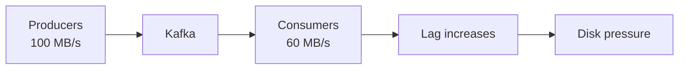

Possible responses:

* increase consumers
* increase partitions
* optimize processing
* batch downstream operations
* increase cluster capacity
* throttle producers
* temporarily reduce workload
* pause noncritical consumers

---

# 33. Lag Is a Leading Indicator

Don't monitor only:

```text
CPU
memory
disk
```

Monitor:

```text
consumer lag
```

Lag often tells you about application health before infrastructure metrics look catastrophic.

For example:

```text
CPU = 50%
Disk = 40%
Network = 45%

but:

Consumer lag:
10K → 100K → 1M → 10M
```

Something is clearly wrong.

---

# 34. Stateful Stream Processing

Kafka becomes particularly powerful when used as the backbone of streaming systems.

Example:

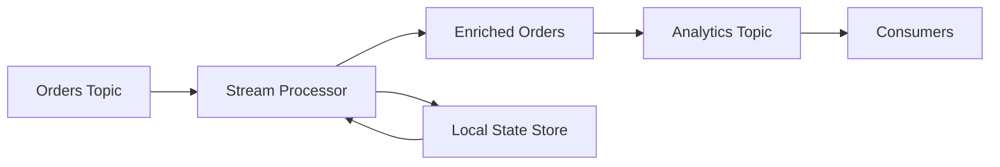

A stream processor may maintain:

```text
customer_id → running_total
```

while consuming events.

Kafka's durable log allows state to be reconstructed.

This creates an important architecture:

> **The event log can act as the durable source from which derived state is rebuilt.**

---

# 35. Why Partitioning Matters Even More for Stateful Processing

Suppose state is:

```text
customer_id → balance
```

You generally want all events for a customer routed to the same partition.

Then one processing task can own:

```text
customer 42
    ↓
partition 3
    ↓
state store 3
```

This dramatically simplifies consistency.

Poor key selection can instead distribute related events across multiple tasks, making stateful processing substantially harder.

---

# 36. Transactional Consume → Process → Produce

A powerful Kafka pattern is:

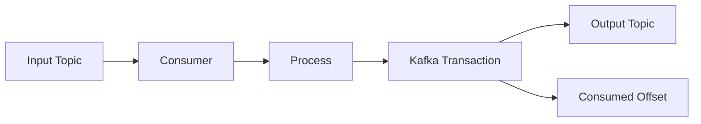

The transaction can atomically associate:

```text
output records
+
input offset
```

Therefore, after recovery, the application can avoid exposing inconsistent intermediate results within Kafka's transactional semantics.

---

# 37. External Databases: The Hard Case

Consider:

```text
Kafka → service → PostgreSQL
```

You cannot simply do:

```text
DB commit
Kafka offset commit
```

as one atomic operation.

Failure between them creates ambiguity.

### Pattern: idempotent consumer

```text
Kafka event
    ↓
transaction
    ├── apply DB change
    └── record event_id as processed
```

If Kafka delivers the event again:

```text
event_id already exists
        ↓
skip duplicate
```

This is often easier operationally than trying to create a distributed transaction spanning Kafka and an arbitrary database.

---

# 38. Transactional Outbox

For:

```text
Application → DB + Kafka
```

a common solution is:

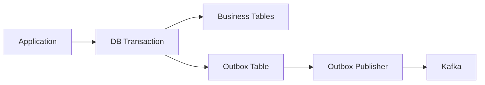

The business update and outbox record are committed together.

A publisher later sends the event to Kafka.

This avoids the classic:

```text
DB succeeded
Kafka failed
```

dual-write problem.

---

# 39. Performance: The Main Levers

Kafka performance is dominated by several interacting variables:

```text
partition count
batching
compression
record size
producer concurrency
consumer concurrency
replication factor
disk throughput
network bandwidth
CPU
```

Don't optimize one in isolation.

---

# 40. Throughput vs Latency

Conceptually:

```text
More batching
    ↓
fewer requests
    ↓
higher throughput
    ↓
potentially higher latency
```

While:

```text
Less batching
    ↓
more immediate sends
    ↓
lower latency
    ↓
higher overhead
```

A good production design often has separate Kafka topics/configurations for:

* ultra-low latency events
* high-throughput bulk streams

rather than trying to make one topic optimal for every workload.

---

# 41. Partition Count Trade-offs

More partitions provide:

* more producer parallelism
* more consumer parallelism
* more broker distribution

But also:

* more metadata
* more open files/resources
* more replication traffic
* more leader management
* more consumer assignment complexity
* potentially more recovery work

Therefore:

> Don't create thousands of partitions simply because "Kafka scales horizontally."

Partition count should come from expected:

```text
write throughput
read throughput
consumer parallelism
ordering requirements
future growth
recovery objectives
```

---

# 42. Hot Partitions

A classic production failure:

```text
Topic has 100 partitions

P0 → 1%
P1 → 1%
...
P98 → 1%
P99 → 50%
```

Overall cluster utilization may look fine.

But P99 is overloaded.

This can cause:

* producer latency
* consumer lag
* uneven broker utilization
* disk imbalance

### Mitigation

Change the key distribution.

Possible strategies:

```text
customer_id
```

instead of:

```text
region
```

or introduce controlled sharding:

```text
customer_id + shard
```

when strict per-customer ordering isn't required globally.

---

# 43. Replication Factor

Typical production thinking might be:

```text
RF=1
```

for disposable data,

versus:

```text
RF=3
```

for important workloads.

Higher RF means:

```text
better failure tolerance
higher storage cost
higher replication bandwidth
higher recovery work
```

If a topic contains 10 TB:

```text
RF=3
≈ 30 TB raw replicated storage
```

before accounting for other overhead.

---

# 44. Under-Replicated Partitions

A key operational metric is:

```text
UnderReplicatedPartitions
```

If:

```text
replication.factor = 3
```

but only two replicas are currently sufficiently caught up:

```text
RF = 3
ISR = 2
```

the partition is under-replicated.

This is an operational warning sign.

If it persists, investigate:

* broker failure
* network problems
* slow disks
* overloaded brokers
* replica fetch lag
* resource saturation

---

# 45. Recovery Time Matters

Suppose a broker stores:

```text
20 TB
```

and fails.

Its replacement may need to replicate enormous amounts of data.

Therefore durability planning must consider:

> **How quickly can the cluster return to a healthy replication state?**

This is often overlooked.

A system might tolerate a single failure theoretically while taking many hours to restore full redundancy.

During that period, another failure may become significantly more dangerous.

---

# 46. Capacity Planning

At minimum, estimate:

```text
ingress throughput
+
replication traffic
+
egress throughput
+
retention storage
+
recovery traffic
```

Suppose:

```text
Ingress = 500 MB/s
RF = 3
```

Raw replication traffic is substantial.

Then consumers may also read:

```text
1 GB/s
```

The network requirement isn't simply:

```text
500 MB/s
```

You need to model the entire traffic topology.

---

# 47. Disk Capacity Calculation

A rough first-order model:

```text
daily storage
≈ ingress_bytes_per_second × 86400 × retention_days × replication_factor
```

For example:

```text
100 MB/s
× 86,400
≈ 8.64 TB/day

7 days
≈ 60.5 TB

RF=3
≈ 181.5 TB
```

Then add operational headroom.

Never provision exactly to the theoretical number.

---

# 48. Disk Is Not Just Capacity

Two disks with the same capacity can behave very differently.

You care about:

* sequential throughput
* random I/O
* latency
* queue depth
* filesystem behavior
* replication workload
* retention deletion
* recovery traffic

Kafka generally likes high-throughput storage, but actual bottlenecks depend heavily on workload and platform.

---

# 49. Schema Evolution

Kafka stores bytes.

Applications need a schema.

For example:

```json
{
  "user_id": 42,
  "name": "Alice"
}
```

Later:

```json
{
  "user_id": 42,
  "name": "Alice",
  "country": "IN"
}
```

Consumers must survive schema changes.

A schema registry and formats such as:

* Avro
* Protobuf
* JSON Schema

can formalize compatibility rules.

---

# 50. Compatibility Strategies

A mature organization should define:

```text
Can old consumers read new events?
Can new consumers read old events?
Can producers roll back safely?
Can services deploy independently?
```

A common strategy is backward compatibility.

Example:

```text
v1:
user_id
name

v2:
user_id
name
country   ← optional
```

Old consumers can continue ignoring the new field.

Schema evolution should be treated as an API compatibility problem.

---

# 51. Topic Design

Don't create topics arbitrarily.

A topic should have a clear:

```text
event model
ownership
retention policy
partitioning strategy
schema
security policy
SLO
```

For example:

```text
orders.created
orders.cancelled
payments.completed
```

is usually more manageable than a giant:

```text
everything.events
```

But excessive topic fragmentation creates operational overhead.

---

# 52. Kafka vs RabbitMQ vs Pulsar

The systems overlap, but their architectural centers of gravity differ.

| Characteristic         | Kafka                        | RabbitMQ                        | Pulsar                                      |
| ---------------------- | ---------------------------- | ------------------------------- | ------------------------------------------- |
| Core abstraction       | Distributed log              | Message broker/queue            | Distributed log + broker/storage separation |
| Ordering               | Per partition                | Queue-level / routing dependent | Per partition/key-shared patterns           |
| Replay                 | Excellent                    | Less central                    | Excellent                                   |
| Consumer model         | Pull-oriented                | Push-oriented commonly          | Both patterns depending API                 |
| Scaling                | Partitions + brokers         | Queues/channels/clustering      | Brokers + distributed storage               |
| Storage model          | Broker-local log             | Broker-managed queues           | BookKeeper-based persistent storage         |
| Long retention         | Strong                       | Less central use case           | Strong                                      |
| Event streaming        | Excellent                    | Possible                        | Excellent                                   |
| Work queues            | Good                         | Excellent                       | Good                                        |
| Multi-tenancy          | Good                         | Good                            | Strong                                      |
| Architecture           | Storage + serving co-located | Broker-centric                  | Compute/storage separated                   |
| Operational complexity | High                         | Moderate                        | High                                        |

### Practical rule

Use Kafka when your dominant requirement is:

> **Durable, replayable, scalable event streams.**

RabbitMQ is often attractive when your dominant requirement is:

> **Flexible routing and traditional work-queue semantics.**

Pulsar is attractive when you want:

> **Kafka-like streaming semantics with a stronger separation between serving brokers and persistent storage.**

The exact choice depends heavily on workload and operational expertise.

---

# 53. Kafka vs Traditional Queue

Traditional queue mental model:

```text
Producer → Queue → Worker
                  ↓
                delete
```

Kafka:

```text
Producer → Log → Consumer
             ↓
           retain
             ↓
       Consumer A
       Consumer B
       Consumer C
```

That distinction enables multiple independent consumers.

For example:

```text
orders.events
     │
     ├── fraud detection
     ├── billing
     ├── analytics
     ├── notifications
     └── ML pipeline
```

Each consumer group maintains its own progress.

---

# 54. Operational Monitoring

A production Kafka dashboard should include at least:

### Broker health

* CPU
* memory
* disk utilization
* disk latency
* network throughput
* request latency
* request queueing

### Replication

* under-replicated partitions
* offline partitions
* ISR shrink/expand events
* replica fetch latency

### Producers

* request latency
* error rate
* retries
* record throughput
* batch sizes
* compression ratio

### Consumers

* consumer lag
* rebalance frequency
* commit latency
* poll latency
* processing latency

---

# 55. Alerting

Good alerts are symptom-oriented.

Examples:

```text
offline partitions > 0
```

is urgent.

```text
under-replicated partitions > 0 for 5 minutes
```

may indicate degraded durability.

```text
consumer lag increasing continuously
```

indicates insufficient processing capacity or a downstream problem.

Avoid alerting simply on:

```text
CPU > 70%
```

without context.

A Kafka broker at 80% CPU may be perfectly healthy.

A broker at 40% CPU with continuously increasing request latency might not be.

---

# 56. Diagnosing Consumer Lag

When lag rises:

```text
Producer rate
      vs
Consumer processing rate
```

Ask:

### 1. Did producer traffic increase?

```text
input ↑
```

### 2. Did consumer throughput decrease?

Perhaps:

```text
DB latency ↑
API latency ↑
GC ↑
CPU ↑
```

### 3. Did a consumer disappear?

```text
consumer count ↓
```

### 4. Did a rebalance occur?

### 5. Is there a hot partition?

This last one is especially important.

Overall lag can hide:

```text
P0 = healthy
P1 = healthy
P2 = millions behind
```

---

# 57. Diagnose From the Bottom Up

A useful debugging hierarchy:

```text
Application
   ↓
Consumer metrics
   ↓
Kafka request metrics
   ↓
Broker metrics
   ↓
Disk / network
   ↓
Infrastructure
```

For example:

```text
Consumer lag increasing
        ↓
Consumer processing time increasing
        ↓
DB query latency increasing
        ↓
Database connection pool exhausted
```

Kafka might merely be the messenger.

Don't automatically blame Kafka for Kafka-visible symptoms.

---

# 58. Logs, Metrics and Traces

Use:

### Metrics

For:

```text
"What is happening?"
```

### Logs

For:

```text
"Why did this particular event occur?"
```

### Distributed traces

For:

```text
"Where did the latency go across services?"
```

A mature system correlates:

```text
Kafka record metadata
+
trace ID
+
application logs
```

so one event can be followed across the architecture.

---

# 59. Upgrade Strategy

Never treat a Kafka upgrade as:

```text
stop cluster
install new version
start cluster
```

Production upgrades should consider:

* broker compatibility
* client compatibility
* rolling upgrade support
* protocol versions
* metadata format
* controller quorum
* replication health
* capacity headroom

A basic principle:

> **Never perform maintenance while the cluster is already degraded unless the risk is explicitly accepted.**

If you already have:

```text
under-replicated partitions
```

don't casually take another broker offline.

---

# 60. Disaster Recovery

Replication protects primarily against failures within a cluster/domain.

It does not automatically protect against:

* region loss
* operator mistakes
* malicious deletion
* application corruption
* cluster-wide configuration errors

For serious workloads consider:

```text
Cluster A
   ↓
replication / mirroring
   ↓
Cluster B
```

and define:

```text
RPO
RTO
```

### RPO

How much data can you afford to lose?

### RTO

How quickly must service recover?

These determine DR architecture.

---

# 61. Disaster Recovery Testing

A DR plan that has never been tested is a hypothesis.

Test:

* broker loss
* multiple broker failures
* consumer failure
* network isolation
* disk exhaustion
* region failure
* schema incompatibility
* replay/backfill
* restoring from backups
* rebuilding consumers from earliest offsets

Measure actual:

```text
RPO
RTO
recovery throughput
recovery lag
```

---

# 62. Common Production Failure Modes

## Failure 1: Too few partitions

Symptoms:

```text
consumer count increases
throughput doesn't
```

Cause:

```text
partition parallelism exhausted
```

---

## Failure 2: Hot partition

Symptoms:

```text
one partition's lag explodes
```

Cause:

```text
bad key distribution
```

---

## Failure 3: Slow downstream dependency

Symptoms:

```text
Kafka healthy
consumer lag rising
application latency rising
```

Cause:

```text
DB/API/downstream bottleneck
```

---

## Failure 4: Excessive rebalances

Symptoms:

```text
consumers constantly joining/leaving
lag oscillates
```

Investigate:

* consumer heartbeat/poll behavior
* long processing
* unstable instances
* deployment churn
* group configuration

---

## Failure 5: Disk exhaustion

Symptoms:

```text
broker disk → 100%
```

Possible causes:

* retention too long
* unexpected traffic growth
* compaction backlog
* replication/recovery pressure
* insufficient capacity

---

## Failure 6: Under-replication

Symptoms:

```text
ISR shrinking
```

Investigate:

```text
disk latency
network
CPU
broker health
replica fetcher behavior
```

---

# 63. Common Design Mistakes

### Mistake: "Kafka guarantees exactly once."

Reality:

> Kafka can provide transactional exactly-once semantics for specific Kafka-to-Kafka workflows; arbitrary external side effects still require idempotency/transactional design.

---

### Mistake: "More partitions always improve performance."

Reality:

> More partitions improve potential parallelism but increase operational and recovery complexity.

---

### Mistake: "Replication factor 3 means I'm safe."

Reality:

> Only if replicas are actually healthy, distributed across failure domains, and your acknowledgment/min-ISR configuration matches your durability requirements.

---

### Mistake: "Consumer lag means Kafka is slow."

Reality:

> Lag means consumers aren't keeping up with the partition head. The cause could be Kafka, consumers, or downstream dependencies.

---

### Mistake: "Kafka is a database."

Reality:

> Kafka is excellent as a durable event log, but it is not a general-purpose relational query engine.

---

# 64. A Staff Engineer's Design Checklist

When designing a Kafka workload, answer these questions **before** creating topics.

### Data model

* What is the event?
* Who owns it?
* What is the schema?
* What is the compatibility policy?

### Ordering

* What must be ordered?
* Per entity?
* Per customer?
* Globally?

### Partitioning

* What key provides that ordering?
* What is the expected cardinality?
* Can a key become hot?
* How many partitions are required?

### Durability

* How much data loss is acceptable?
* What replication factor?
* What `min.insync.replicas`?
* What producer `acks`?

### Retention

* How long must events be replayable?
* Is deletion retention enough?
* Is compaction appropriate?

### Consumers

* How many consumers?
* How much processing capacity?
* What happens when a consumer dies?
* How is idempotency handled?

### Performance

* Expected ingress?
* Expected egress?
* Record size?
* Batch size?
* Compression?
* Latency SLO?

### Failure

* What happens when one broker fails?
* Two brokers?
* A rack?
* A region?
* How long does replication recovery take?

---

# 65. A Reference Production Architecture

A reasonable conceptual architecture:

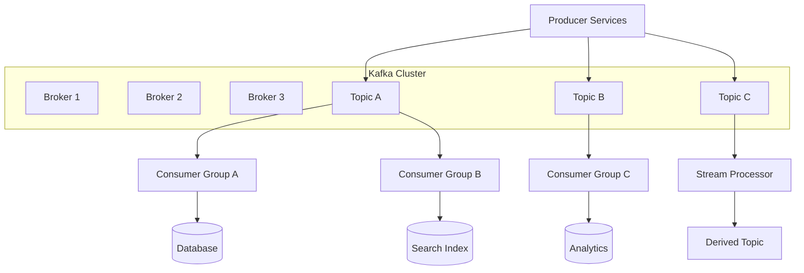

The architectural beauty is that producers don't need to know how many downstream consumers exist.

Kafka becomes the decoupling layer.

---

# 66. Internal Design → Observable Behavior

This is the mental model I'd recommend memorizing:

| Internal choice                     | Observable consequence                                 |
| ----------------------------------- | ------------------------------------------------------ |
| More partitions                     | More parallelism, more metadata/operational complexity |
| Key-based partitioning              | Per-key ordering                                       |
| Poor key distribution               | Hot partitions                                         |
| Append-only log                     | High sequential write efficiency                       |
| Segment files                       | Efficient retention/deletion                           |
| Long retention                      | Replay capability + high storage cost                  |
| Compaction                          | Efficient latest-state retention                       |
| Higher RF                           | Better fault tolerance + more storage/network          |
| `acks=all`                          | Stronger write durability + latency                    |
| High `min.insync.replicas`          | Less availability during failures                      |
| Large batches                       | Better throughput/compression + possible latency       |
| Compression                         | Lower bandwidth/storage + CPU cost                     |
| Consumer groups                     | Horizontal processing                                  |
| More consumers than partitions      | Idle consumers                                         |
| Frequent rebalances                 | Processing disruption                                  |
| Idempotent consumers                | Safe duplicate handling                                |
| Transactions                        | Stronger Kafka-to-Kafka processing guarantees          |
| Stateful partition-local processing | Efficient local state                                  |
| KRaft quorum                        | Distributed metadata consensus                         |
| File-backed logs                    | Dataset need not fit in RAM                            |

---

# 67. The Three Most Important Kafka Invariants

If you're preparing for staff-level interviews/design reviews, these are worth internalizing.

## Invariant 1: Ordering is partition-local

```text
Partition → ordered
Topic → not globally ordered
```

Therefore:

> Partitioning is simultaneously a **scaling decision and a correctness decision**.

---

## Invariant 2: Consumer progress is independent of the log

Kafka doesn't say:

```text
"message consumed → delete message"
```

Instead:

```text
log remains
consumer maintains position
```

Therefore multiple consumers can independently replay the same history.

---

## Invariant 3: Durability depends on replication state

Having:

```text
RF = 3
```

doesn't by itself mean every write exists safely on three healthy replicas.

You must reason about:

```text
leader
ISR
acks
min.insync.replicas
failure timing
```

That's where Kafka's durability model actually comes from.

---

# 68. Kafka as a Distributed Systems Primitive

At the highest level, Kafka provides four very useful primitives:

```text
1. Ordered append
2. Durable storage
3. Replication
4. Consumer-position tracking
```

From these, you can construct:

```text
event-driven microservices
stream processing
CDC pipelines
event sourcing
analytics pipelines
work distribution
materialized views
cache rebuilding
data integration
```

That's why Kafka is much more than a message queue.

---

# 69. Short Cheatsheet

| Term                           | Definition                                                        |
| ------------------------------ | ----------------------------------------------------------------- |
| **Broker**                     | Kafka server storing and serving partitions                       |
| **Topic**                      | Logical stream composed of partitions                             |
| **Partition**                  | Ordered append-only log/shard                                     |
| **Offset**                     | Position of a record in a partition                               |
| **Producer**                   | Writes records to Kafka                                           |
| **Consumer**                   | Reads records from Kafka                                          |
| **Consumer group**             | Consumers collectively processing partitions                      |
| **Consumer lag**               | Distance between consumer progress and log head                   |
| **Leader**                     | Replica coordinating partition writes                             |
| **Follower**                   | Replica copying partition data                                    |
| **ISR**                        | Replicas considered sufficiently synchronized                     |
| **Replication factor**         | Number of replicas per partition                                  |
| **Retention**                  | Rules determining how long data remains                           |
| **Compaction**                 | Retain latest record per key over time                            |
| **Segment**                    | Physical chunk of a partition log                                 |
| **`acks=0`**                   | Don't wait for broker acknowledgment                              |
| **`acks=1`**                   | Wait for leader acknowledgment                                    |
| **`acks=all`**                 | Wait for required ISR acknowledgment                              |
| **`min.insync.replicas`**      | Minimum ISR required for certain writes                           |
| **Rebalance**                  | Redistribution of partitions among group members                  |
| **KRaft**                      | Kafka's Raft-based metadata quorum architecture                   |
| **Idempotence**                | Repeating an operation doesn't change its final effect            |
| **Transaction**                | Atomic Kafka operations across supported transactional boundaries |
| **Hot partition**              | Partition receiving disproportionate workload                     |
| **Under-replicated partition** | Partition with fewer healthy/in-sync replicas than configured     |

---

# 70. Final Staff-Level Mental Model

If you remember only one diagram, make it this:

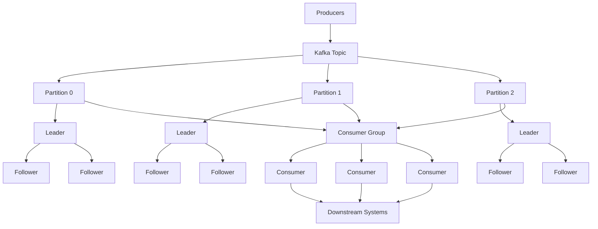

Then reason about the system through five questions:

### 1. **Where is the data?**

→ partitions, segments, brokers, replicas

### 2. **Who owns the ordering?**

→ partition/key

### 3. **When is the data durable?**

→ leader, ISR, acknowledgments, `min.insync.replicas`

### 4. **Who has processed it?**

→ consumer group + offsets

### 5. **What happens when something fails?**

→ replication, leader election, rebalance, replay, idempotency

That mental model is more valuable than memorizing hundreds of Kafka configuration properties.

**The staff-engineer perspective is ultimately to reason from workload → partitioning → replication → processing semantics → failure model → operational SLOs, rather than starting from Kafka configuration knobs.**
