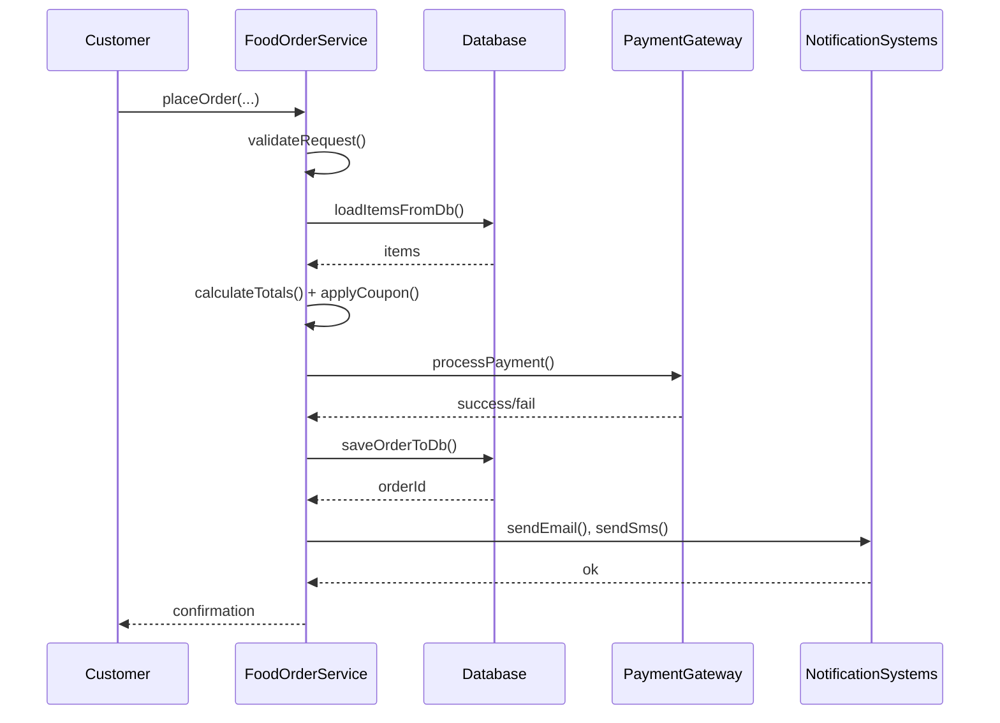
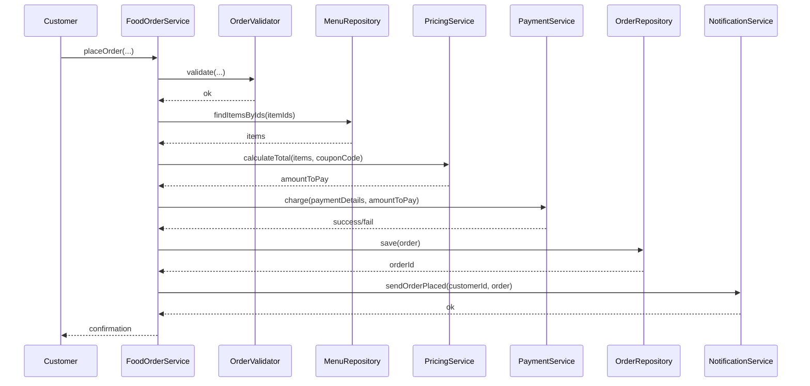
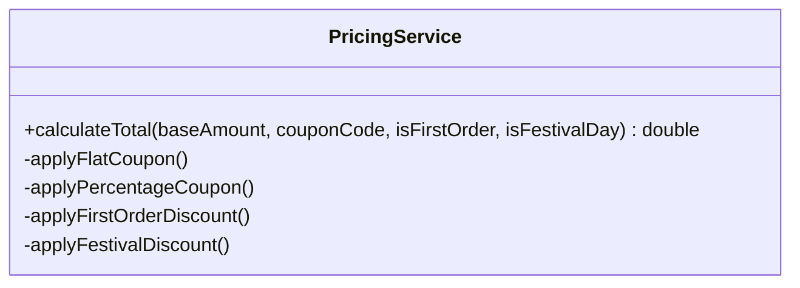
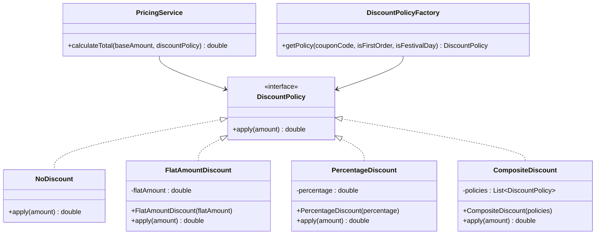
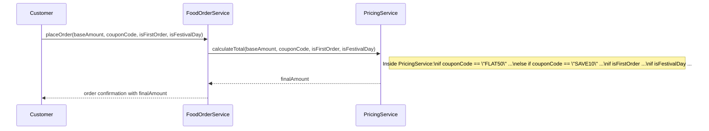
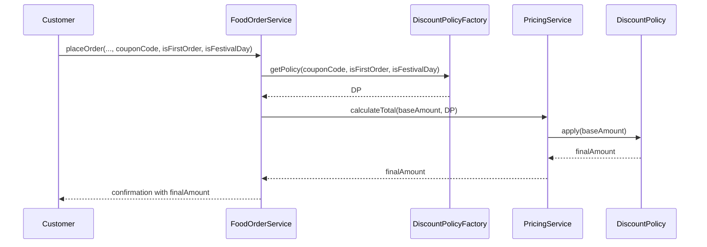

# Module 1 : OOD

## SOLID principles

### Single Responsibilty Principle (SRP)

Intent: A software entity (class, interface etc.) should have only one reason to change.

#### Example

This single class does too many things: validates orders, calculates totals, applies discounts, talks to the database, and sends notifications.

```java
public class FoodOrderService {

    public void placeOrder(String customerId,
                           List<String> itemIds,
                           String address,
                           String paymentDetails,
                           String couponCode) {

        // 1. Validate input
        if (customerId == null || customerId.isBlank()) {
            throw new IllegalArgumentException("Invalid customer");
        }
        if (itemIds == null || itemIds.isEmpty()) {
            throw new IllegalArgumentException("No items selected");
        }

        // 2. Fetch menu items from DB (fake)
        List<MenuItem> items = loadItemsFromDb(itemIds);

        // 3. Calculate total
        double subtotal = 0.0;
        for (MenuItem item : items) {
            subtotal += item.price();
        }

        // 4. Apply coupon
        double discount = 0.0;
        if (couponCode != null && !couponCode.isBlank()) {
            if (couponCode.equals("NEW50")) {
                discount = subtotal * 0.5;
            } else if (couponCode.equals("FREEDESSERT")) {
                discount = 100.0;
            }
        }
        double finalAmount = subtotal - discount;

        // 5. Process payment (fake)
        if (!processPayment(paymentDetails, finalAmount)) {
            throw new RuntimeException("Payment failed");
        }

        // 6. Save order to DB (fake)
        String orderId = saveOrderToDb(customerId, items, address, finalAmount);

        // 7. Send notifications (email + SMS)
        sendEmail(customerId, orderId, finalAmount);
        sendSms(customerId, orderId);

        System.out.println("Order placed successfully: " + orderId);
    }

    // ----- Everything below is also crammed into this class -----

    private List<MenuItem> loadItemsFromDb(List<String> itemIds) {
        // DB logic here
        return List.of(); // stub
    }

    private boolean processPayment(String paymentDetails, double amount) {
        // Payment gateway logic
        return true; // stub
    }

    private String saveOrderToDb(String customerId,
                                 List<MenuItem> items,
                                 String address,
                                 double finalAmount) {
        // Insert into orders table
        return "ORDER123"; // stub
    }

    private void sendEmail(String customerId, String orderId, double amount) {
        // SMTP logic here
    }

    private void sendSms(String customerId, String orderId) {
        // SMS gateway logic
    }

    public record MenuItem(String id, String name, double price) {}
}
```

Problems (multiple responsibilities):

- Validation logic
- Pricing and discount logic
- Payment processing
- Persistence (DB) logic
- Notification (email/SMS) logic

Any change in discount rules, payment integration, email templates, or DB schema forces changes in this one class.

As per SRP, we split responsibilities into cohesive classes, keeping one main orchestrator.

```java
// 1 Core domain types
public record MenuItem(String id, String name, double price) {}

public record Order(
        String id,
        String customerId,
        List<MenuItem> items,
        String deliveryAddress,
        double amountToPay
) {}
```

```java
// 2 Responsibility‑focused services
public class OrderValidator {
    public void validate(String customerId, List<String> itemIds, String address) {
        if (customerId == null || customerId.isBlank()) {
            throw new IllegalArgumentException("Invalid customer");
        }
        if (itemIds == null || itemIds.isEmpty()) {
            throw new IllegalArgumentException("No items selected");
        }
        if (address == null || address.isBlank()) {
            throw new IllegalArgumentException("Invalid address");
        }
    }
}

public class MenuRepository {
    public List<MenuItem> findItemsByIds(List<String> itemIds) {
        // Only menu lookup logic here
        return List.of(); // stub
    }
}

public class PricingService {
    public double calculateTotal(List<MenuItem> items, String couponCode) {
        double subtotal = items.stream()
                .mapToDouble(MenuItem::price)
                .sum();

        double discount = switch (couponCode) {
            case "NEW50" -> subtotal * 0.5;
            case "FREEDESSERT" -> 100.0;
            case null, default -> 0.0;
        };

        return subtotal - discount;
    }
}

public class PaymentService {
    public boolean charge(String paymentDetails, double amount) {
        // Only payment logic here
        return true; // stub
    }
}

public class OrderRepository {
    public String save(Order order) {
        // Only DB persistence here
        return order.id(); // stub
    }
}

public class NotificationService {
    public void sendOrderPlaced(String customerId, Order order) {
        sendEmail(customerId, order);
        sendSms(customerId, order);
    }

    private void sendEmail(String customerId, Order order) {
        // email logic
    }

    private void sendSms(String customerId, Order order) {
        // sms logic
    }
}
```

Each class now has a single reason to change: validation rules, pricing rules, payment integration, database schema, or notification templates respectively.

```java
// 3 Thin orchestrator FoodOrderService
public class FoodOrderService {

    private final OrderValidator validator;
    private final MenuRepository menuRepository;
    private final PricingService pricingService;
    private final PaymentService paymentService;
    private final OrderRepository orderRepository;
    private final NotificationService notificationService;

    public FoodOrderService(OrderValidator validator,
                            MenuRepository menuRepository,
                            PricingService pricingService,
                            PaymentService paymentService,
                            OrderRepository orderRepository,
                            NotificationService notificationService) {
        this.validator = validator;
        this.menuRepository = menuRepository;
        this.pricingService = pricingService;
        this.paymentService = paymentService;
        this.orderRepository = orderRepository;
        this.notificationService = notificationService;
    }

    public void placeOrder(String customerId,
                           List<String> itemIds,
                           String address,
                           String paymentDetails,
                           String couponCode) {

        // 1. Validate request
        validator.validate(customerId, itemIds, address);

        // 2. Load menu items
        List<MenuItem> items = menuRepository.findItemsByIds(itemIds);

        // 3. Price calculation
        double amountToPay = pricingService.calculateTotal(items, couponCode);

        // 4. Payment
        if (!paymentService.charge(paymentDetails, amountToPay)) {
            throw new RuntimeException("Payment failed");
        }

        // 5. Persist order
        Order order = new Order(
                generateOrderId(),
                customerId,
                items,
                address,
                amountToPay
        );
        orderRepository.save(order);

        // 6. Notify customer
        notificationService.sendOrderPlaced(customerId, order);
    }

    private String generateOrderId() {
        return "ORD-" + System.currentTimeMillis();
    }
}
```

Now `FoodOrderService` is just an orchestrator coordinating specialized components rather than doing everything itself.

#### Sequence Diagram

Before refactor (one class doing everything)



All responsibilities live inside `F: FoodOrderService`.

After refactor (orchestrator + collaborators)



The flow is the same, but the work is split across cohesive services, which is exactly what SRP aims for.

---

### Open Closed Principle (OCP)

Intent: Software entities like classes, modules and functions should be open for extension but closed for modifications.

#### Example

What if we need to handle different types of discounts to calculate the final price?
A bad way: add mulitple if/else or switch statements to the current `PricingService` implementation.

```java
public class PricingService {

    public double calculateTotal(double baseAmount,
                                 String couponCode,
                                 boolean isFirstOrder,
                                 boolean isFestivalDay) {

        double discounted = baseAmount;

        // Flat coupon
        if (couponCode != null && couponCode.equals("FLAT50")) {
            discounted -= 50;
        }

        // Percentage coupon
        if (couponCode != null && couponCode.equals("SAVE10")) {
            discounted *= 0.9;
        }

        // First-order discount
        if (isFirstOrder) {
            discounted *= 0.95;
        }

        // Festival day discount
        if (isFestivalDay) {
            discounted *= 0.8;
        }

        return Math.max(discounted, 0);
    }
}
```

To add a new rule like “Weekend discount”, you must edit this class and add another condition, violating OCP.

Class diagram with the bad implementation which violates OCP.



PricingService keeps growing every time business adds a new discount type.

Several design patterns facilitate OCP:

- Strategy Pattern: As seen in our example, allows algorithms to be selected at runtime.
- Decorator Pattern: Allows adding responsibilities to objects dynamically.
- Template Method Pattern: Defines the skeleton of an algorithm in a superclass but lets subclasses override specific steps.
- Factory Pattern (and Abstract Factory): Can be used to create instances of different classes that implement a common interface, allowing new types to be added easily.
- Observer Pattern: Allows objects to subscribe to events and react to them, enabling new subscribers to be added without changing the event publisher.

To refactor this example per OCP, we rely on the **Strategy Pattern** to calculate discounts.

```java
public interface DiscountPolicy {
    double apply(double amount);
}

// No discount
public final class NoDiscount implements DiscountPolicy {
    @Override
    public double apply(double amount) {
        return amount;
    }
}

// Flat amount coupon, e.g., FLAT50
public final class FlatAmountDiscount implements DiscountPolicy {

    private final double flatAmount;

    public FlatAmountDiscount(double flatAmount) {
        this.flatAmount = flatAmount;
    }

    @Override
    public double apply(double amount) {
        return Math.max(0, amount - flatAmount);
    }
}

// Percentage discount, e.g., 10% off
public final class PercentageDiscount implements DiscountPolicy {

    private final double percentage; // 0.10 for 10%

    public PercentageDiscount(double percentage) {
        this.percentage = percentage;
    }

    @Override
    public double apply(double amount) {
        return amount * (1 - percentage);
    }
}

// Composable discount that chains multiple policies
public final class CompositeDiscount implements DiscountPolicy {

    private final List<DiscountPolicy> policies;

    public CompositeDiscount(List<DiscountPolicy> policies) {
        this.policies = List.copyOf(policies);
    }

    @Override
    public double apply(double amount) {
        double result = amount;
        for (DiscountPolicy policy : policies) {
            result = policy.apply(result);
        }
        return result;
    }
}

```

Now, the `PricingService` never changes as you introduce new discount types; you only add more `DiscountPolicy` implementations.

```java
public final class PricingService {

    public double calculateTotal(double baseAmount, DiscountPolicy discountPolicy) {
        return discountPolicy.apply(baseAmount);
    }
}
```

Only this factory may change when your business rules change; the core `PricingService` and existing discount classes remain untouched, honoring OCP.

```java
public final class DiscountPolicyFactory {

    public DiscountPolicy getPolicy(String couponCode,
                                   boolean isFirstOrder,
                                   boolean isFestivalDay) {

        List<DiscountPolicy> policies = new ArrayList<>();

        if (couponCode == null || couponCode.isBlank()) {
            policies.add(new NoDiscount());
        } else if (couponCode.equals("FLAT50")) {
            policies.add(new FlatAmountDiscount(50));
        } else if (couponCode.equals("SAVE10")) {
            policies.add(new PercentageDiscount(0.10));
        }

        if (isFirstOrder) {
            policies.add(new PercentageDiscount(0.05));
        }

        if (isFestivalDay) {
            policies.add(new PercentageDiscount(0.20));
        }

        if (policies.isEmpty()) {
            return new NoDiscount();
        }

        if (policies.size() == 1) {
            return policies.getFirst();
        }

        return new CompositeDiscount(policies);
    }
}
```

Class diagram with strategy hierarchy



Adding `WeekendDiscount` or `LoyaltyDiscount` means adding another class that implements DiscountPolicy; existing classes stay closed to modification.

#### Sequence Diagram

Before applying OCP



After applying OCP



The flow for calculating price does not change when a new discount type is introduced; only the list of available DiscountPolicy implementations grows.

---

### Liskov Substitution Principle (LSP)

Derived types must be completely substitutable for their base types.

---

### Interface Segregation Principle (ISP)

Clients should not be forced to depend upon interfaces that they don't use.

---

### Dependency Inversion Principle (DIP)

- High-level modules should not depend on low-level modules. Both should depend on abstractions.
- Abstractions should not depend on details. Details should depend on abstractions.

---

## OO: Encapsulation & Abstraction

### Information Hiding

#### What it means

- Concealing Details: It involves keeping the inner workings, data structures, and algorithms of a class or module private.
- Public Interface: Only a well-defined public interface (methods) is exposed, through which other parts of the system can interact with the object.
- Separation of Concerns: It helps in separating what an object does (its public behavior) from how it does it (its internal implementation).

#### Why it's important (Benefits)

- Reduced Complexity: By hiding implementation details, users of the object don't need to understand its internal complexity, making the system easier to understand and use.
- Easier Maintenance: If you need to change the internal implementation of an object (e.g., improve an algorithm, change a data structure), you can do so without affecting other parts of the system, as long as the public interface remains the same.
- Improved Robustness: It prevents external code from accidentally or intentionally corrupting an object's internal state. Data is protected and can only be manipulated through the provided methods.
- Better Reusability: Modules with hidden information are often more self-contained and less dependent on external factors, making them easier to reuse in different contexts.
- Team Collaboration: In large projects, different teams can work on different modules concurrently without constantly stepping on each other's toes, as long as they adhere to the public interfaces.

#### How it's achieved

- Access Modifiers: Programming languages use access modifiers (like private, protected in Java/C#, public) to enforce information hiding. private members are hidden from outside classes, while public members form the exposed interface.
- Encapsulation: This is the primary mechanism for achieving information hiding. Encapsulation bundles data (attributes) and the methods that operate on the data into a single unit (a class) and restricts direct access to some of the object's components.
- Abstraction: While closely related, abstraction focuses on showing only essential features and hiding complex background details, often through abstract classes and interfaces. Information hiding is a technique used to achieve abstraction.

**Example:**

Imagine you have a Car object.

- Public Interface (what's exposed): startEngine(), accelerate(), brake(), turnLeft(), turnRight().
- Hidden Information (internal details): The specific type of engine (V6, electric), how the fuel injection system works, the internal mechanics of the transmission, how the anti-lock brakes are implemented.

As a driver, you don't need to know the intricate details of the engine to drive the car. You just need to know how to use the accelerator and brake. If the car manufacturer decides to switch from a gasoline engine to an electric motor, as long as the startEngine(), accelerate(), brake() methods work similarly, you (the "client") don't need to change how you interact with the car. This is information hiding in action.

Information hiding is a cornerstone of good object-oriented design, leading to more modular, maintainable, and robust software systems.

### Data Protection

Data Protection refers to the practice of restricting direct access to an object's internal data (its attributes or state) from outside the object itself. Instead, access is managed through defined interfaces, typically public methods.

Here's a breakdown of what that means and why it's important:

1. Why Data Protection?

Maintaining Data Integrity: It prevents external code from inadvertently or maliciously changing an object's internal state in an invalid way. For example, if you have a BankAccount object, you wouldn't want external code to directly set the balance to a negative number; instead, you'd provide deposit() and withdraw() methods that include validation logic.
Reducing Dependencies (Loose Coupling): When internal data is protected, changes to the object's internal representation don't necessarily affect the code that uses the object, as long as the public interface remains the same. This makes your code more flexible and easier to maintain.
Simplifying Object Usage: Users of an object don't need to know its internal workings. They only need to understand its public interface to interact with it, making the object easier to use and understand.
How is it achieved?

Access Modifiers: This is the primary mechanism. In many object-oriented languages (like Java, C++, C#), keywords like private or protected are used to control the visibility of attributes and methods. Marking an attribute as private means it can only be accessed from within the class itself.
Encapsulation: Data protection is a core aspect of encapsulation. Encapsulation bundles the data (attributes) and the methods (behaviors) that operate on the data into a single unit (a class), and restricts direct access to some of the object's components.
Getters and Setters (Accessor and Mutator Methods): While direct access is restricted, you often need a way for external code to read or sometimes modify the data. This is done through public methods:
Getters (Accessors): Methods that provide read-only access to an attribute (e.g., getBalance()).
Setters (Mutators): Methods that allow controlled modification of an attribute, often including validation logic (e.g., setBalance(amount) which would check if amount is valid).
Example:

Consider a simple Circle class:

Without Data Protection (Bad Practice):

```java
class Circle {
    public double radius; // Public field, anyone can change it directly
    public double calculateArea() {
        return Math.PI * radius * radius;
    }
}
// In another part of the code:
Circle myCircle = new Circle();
myCircle.radius = -5.0; // Oops! A negative radius is invalid.
System.out.println(myCircle.calculateArea()); // Area will be calculated with invalid radius.

```
With Data Protection (Good Practice using Encapsulation):

```java
class Circle {
    private double radius; // Private field, cannot be accessed directly from outside
    public Circle(double radius) {
        if (radius <= 0) {
            throw new IllegalArgumentException("Radius must be positive.");
        }
        this.radius = radius;
    }
    public double getRadius() { // Public getter to read the radius
        return radius;
    }
    public void setRadius(double radius) { // Public setter to modify the radius with validation
        if (radius <= 0) {
            throw new IllegalArgumentException("Radius must be positive.");
        }
        this.radius = radius;
    }
    public double calculateArea() {
        return Math.PI * radius * radius;
    }
}
// In another part of the code:
Circle myCircle = new Circle(10.0);
// myCircle.radius = -5.0; // This would cause a compile-time error!
myCircle.setRadius(12.0); // Valid change
// myCircle.setRadius(-5.0); // This would throw an IllegalArgumentException at runtime, protecting the data.
System.out.println(myCircle.calculateArea());
```
In essence, data protection through encapsulation ensures that objects manage their own state, leading to more robust, maintainable, and understandable code. It's a fundamental principle for good low-level design.

3. Abstract Classes
4. Interfaces
5. Implementation details
6. Cient interaction

## OO: Inheritance vs Composition

## OO: Polymorphism

## OO: Interfaces & Abstract Classes

## Resources

SOLID Principles

1. [OOD Principles](https://www.oodesign.com/design-principles/)
2. [Algomaster - SOLID](https://algomaster.io/learn/lld/srp)
3. [SOLID Principles](https://bool.dev/blog/detail/solid-principles)
4. [OOD Cheatsheet](https://denniskats.dev/resources/pdfs/OOD%20Final.pdf)
5. [SW Cheatsheets](https://github.com/Furkan-Dursun/Software-Cheat-Sheets?tab=readme-ov-file)
