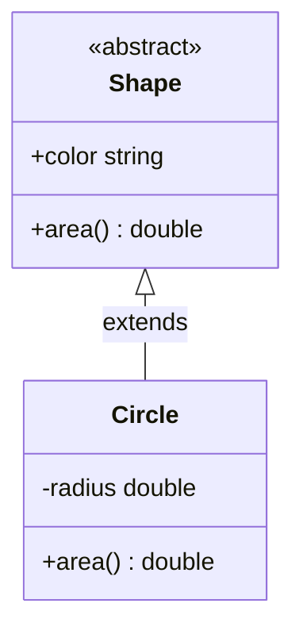
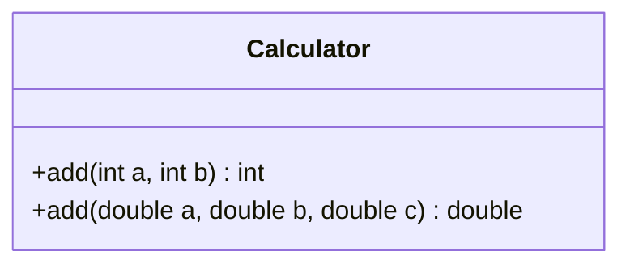
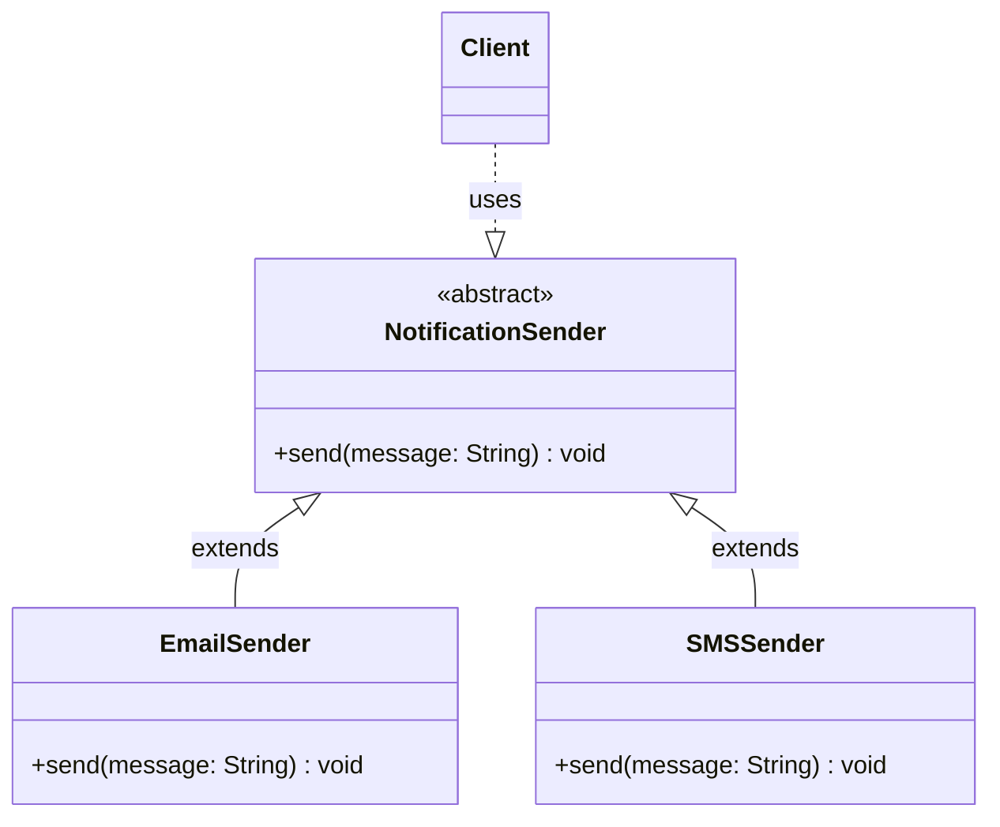
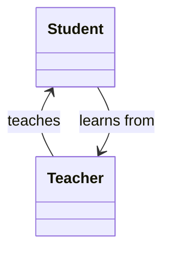
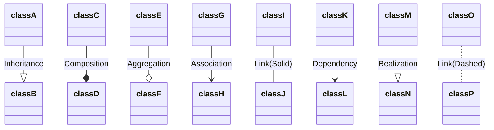

# Module 1 : OOD

## SOLID principles

1. [Single Responsibilty Principle (SRP)](solid-srp.md)
2. [Open Closed Principle (OCP)](solid-ocp.md)
3. [Liskov Substitution Principle (LSP)](solid-lsp.md)
4. [Interface Segregation Principle (ISP)](solid-isp.md)
5. [Dependency Inversion Principle (DIP)](solid-dip.md)

---

## OO Concepts

### Encapsulation

Encapsulation bundles data and methods into classes while hiding internal details, making it essential for robust low-level design in real-world systems like banking apps or payment processors.

`Encapsulation = Data Hiding + Controlled Access`

- Use private for fields and provide public getters/setters with validation (e.g., reject negative deposits).
- Centralize business rules in methods to enforce invariants, like minimum withdrawal amounts.
- Favor immutable objects where possible (final fields) for thread-safety in concurrent apps.
- Expose only necessary APIs; avoid oversized public interfaces to minimize coupling.
- Best practice: Always validate inputs in setters and log invalid attempts for auditing in enterprise systems.
​

### Abstraction

Abstraction simplifies complex systems in low-level design by exposing essential interfaces while concealing implementation details, enabling flexible, scalable code in applications like payment gateways or notification services.

- Define minimal interfaces with only essential methods to avoid "fat" contracts.
- Use abstract classes for shared code (e.g., common fields) and interfaces for pure contracts.
​- Program to interfaces (e.g., List over ArrayList) for flexibility via Dependency Inversion.
- Combine with polymorphism: Clients interact via base types, enabling runtime swaps.
- Best practice: Start with "what" (user needs), then abstract "how" (details), and validate via Liskov Substitution—subclasses must interchangeable without breaking behavior.

Example : 


#### Encapsulation vs Abstraction

| Aspect | Abstraction                                             | Encapsulation                                                  |
|--------|---------------------------------------------------------|----------------------------------------------------------------|
| Focus  | "What" the object does (interface level)              ​  | "How" internals are protected (data level) geeksforgeeks​       |
| Goal   | Reduce complexity via contracts                         | Ensure data integrity and controlled access almabetter​         |
| Tools  | Interfaces/abstract classes                             | Access modifiers (private/public) + getters/setters algomaster​ |
| Scope  | External client view                                    | Internal implementation bundling geeksforgeeks​                 |

Encapsulation Example (BankAccount - Data Protection)

```java
public class BankAccount {
    private double balance;  // Hidden data

    public void deposit(double amount) {
        if (amount > 0) balance += amount;  // Validation inside
    }
    
    public double getBalance() { return balance; }
}
```

Abstraction Example (PaymentProcessor - Interface Simplicity)

```java
interface PaymentProcessor {
    void process(double amount);  // Contract: "what" to do
}

class CreditCardProcessor implements PaymentProcessor {
    public void process(double amount) {
        // Complex: validate card, API call, logging
    }
}
```

### Polymorphism

1. Compile-Time Polymorphism (Method Overloading) : Overloading lets multiple methods share a name but differ in parameters; resolved at compile time for flexible APIs.

```java
public class Calculator {
    // Overload 1: Two integers
    public int add(int a, int b) {
        return a + b;  // Compiler picks based on args
    }
    
    // Overload 2: Three doubles
    public double add(double a, double b, double c) {
        return a + b + c;
    }
}

// Usage
Calculator calc = new Calculator();
System.out.println(calc.add(5, 3));     // Calls int version: 8
System.out.println(calc.add(1.0, 2.0, 3.0));  // Calls double version: 6.0
```

Class diagram



2. Run-Time Polymorphism (Method Overriding) : Overriding lets subclasses redefine parent methods; resolved at runtime based on object type.

```java
abstract class NotificationSender {
    public abstract void send(String message);  // Contract
}

class EmailSender extends NotificationSender {
    @Override
    public void send(String message) {
        System.out.println("Email: " + message);  // Specific impl
    }
}

class SMSSender extends NotificationSender {
    @Override
    public void send(String message) {
        System.out.println("SMS: " + message);
    }
}

// Usage
NotificationSender sender = new EmailSender();  // Runtime decides
sender.send("Order shipped");  // Outputs: Email: Order shipped

sender = new SMSSender();
sender.send("Order shipped");  // Outputs: SMS: Order shipped
```

Class diagram



### Inheritance

Inheritance enables code reuse by letting you define common logic once in a base class and then extend or specialize it in multiple derived classes.

## Object Relationships

### Inheritance

### Polymorphism

### Association (HAS-A / USES-A relationship)

Association represents a relationship between two classes where one object uses, communicates with, or references another.

_"Has-a" relationship (often implied)_ : While not as strict as composition or aggregation, association often implies a "has-a" relationship, meaning an object of one class "has" or uses an object of another class. For example, a `Student` "has an" `Address`.

_Loose Coupling_ : Associations tend to represent a looser coupling between classes compared to aggregation or composition. **Objects can exist independently of each other.** The association can be unidirectional or bidirectional, and can follow different multiplicity patterns (1-to-1, 1-to-many, etc.).

_How it differs from other relationships (which are also types of association)_ :


While aggregation and composition are specialized forms of association, "association" itself is the most general form.

Aggregation: Represents a "part-of" relationship where the "part" can exist independently of the "whole." (e.g., a `Department` has `Professors` - professors can exist outside a department).

Composition: Represents a strong "part-of" relationship where the "part" cannot exist independently of the "whole." If the "whole" is destroyed, the "part" is also destroyed. (e.g., a `House` has `Rooms` - a room cannot exist without a house).



### Aggregation


### Composition

### Dependency

### Realization



## OO: Encapsulation & Abstraction

### Information Hiding

#### What it means

- Concealing Details: It involves keeping the inner workings, data structures, and algorithms of a class or module private.
- Public Interface: Only a well-defined public interface (methods) is exposed, through which other parts of the system can interact with the object.
- Separation of Concerns: It helps in separating what an object does (its public behavior) from how it does it (its internal implementation).

#### Why it's important (Benefits)

- Reduced Complexity: By hiding implementation details, users of the object don't need to understand its internal complexity, making the system easier to understand and use.
- Easier Maintenance: If you need to change the internal implementation of an object (e.g., improve an algorithm, change a data structure), you can do so without affecting other parts of the system, as long as the public interface remains the same.
- Improved Robustness: It prevents external code from accidentally or intentionally corrupting an object's internal state. Data is protected and can only be manipulated through the provided methods.
- Better Reusability: Modules with hidden information are often more self-contained and less dependent on external factors, making them easier to reuse in different contexts.
- Team Collaboration: In large projects, different teams can work on different modules concurrently without constantly stepping on each other's toes, as long as they adhere to the public interfaces.

#### How it's achieved

- Access Modifiers: Programming languages use access modifiers (like private, protected in Java/C#, public) to enforce information hiding. private members are hidden from outside classes, while public members form the exposed interface.
- Encapsulation: This is the primary mechanism for achieving information hiding. Encapsulation bundles data (attributes) and the methods that operate on the data into a single unit (a class) and restricts direct access to some of the object's components.
- Abstraction: While closely related, abstraction focuses on showing only essential features and hiding complex background details, often through abstract classes and interfaces. Information hiding is a technique used to achieve abstraction.

**Example:**

Imagine you have a Car object.

- Public Interface (what's exposed): startEngine(), accelerate(), brake(), turnLeft(), turnRight().
- Hidden Information (internal details): The specific type of engine (V6, electric), how the fuel injection system works, the internal mechanics of the transmission, how the anti-lock brakes are implemented.

As a driver, you don't need to know the intricate details of the engine to drive the car. You just need to know how to use the accelerator and brake. If the car manufacturer decides to switch from a gasoline engine to an electric motor, as long as the startEngine(), accelerate(), brake() methods work similarly, you (the "client") don't need to change how you interact with the car. This is information hiding in action.

Information hiding is a cornerstone of good object-oriented design, leading to more modular, maintainable, and robust software systems.

### Data Protection

Data Protection refers to the practice of restricting direct access to an object's internal data (its attributes or state) from outside the object itself. Instead, access is managed through defined interfaces, typically public methods.

Here's a breakdown of what that means and why it's important:

1. Why Data Protection?

Maintaining Data Integrity: It prevents external code from inadvertently or maliciously changing an object's internal state in an invalid way. For example, if you have a BankAccount object, you wouldn't want external code to directly set the balance to a negative number; instead, you'd provide deposit() and withdraw() methods that include validation logic.
Reducing Dependencies (Loose Coupling): When internal data is protected, changes to the object's internal representation don't necessarily affect the code that uses the object, as long as the public interface remains the same. This makes your code more flexible and easier to maintain.
Simplifying Object Usage: Users of an object don't need to know its internal workings. They only need to understand its public interface to interact with it, making the object easier to use and understand.
How is it achieved?

Access Modifiers: This is the primary mechanism. In many object-oriented languages (like Java, C++, C#), keywords like private or protected are used to control the visibility of attributes and methods. Marking an attribute as private means it can only be accessed from within the class itself.
Encapsulation: Data protection is a core aspect of encapsulation. Encapsulation bundles the data (attributes) and the methods (behaviors) that operate on the data into a single unit (a class), and restricts direct access to some of the object's components.
Getters and Setters (Accessor and Mutator Methods): While direct access is restricted, you often need a way for external code to read or sometimes modify the data. This is done through public methods:
Getters (Accessors): Methods that provide read-only access to an attribute (e.g., getBalance()).
Setters (Mutators): Methods that allow controlled modification of an attribute, often including validation logic (e.g., setBalance(amount) which would check if amount is valid).
Example:

Consider a simple Circle class:

Without Data Protection (Bad Practice):

```java
class Circle {
    public double radius; // Public field, anyone can change it directly
    public double calculateArea() {
        return Math.PI * radius * radius;
    }
}
// In another part of the code:
Circle myCircle = new Circle();
myCircle.radius = -5.0; // Oops! A negative radius is invalid.
System.out.println(myCircle.calculateArea()); // Area will be calculated with invalid radius.

```
With Data Protection (Good Practice using Encapsulation):

```java
class Circle {
    private double radius; // Private field, cannot be accessed directly from outside
    public Circle(double radius) {
        if (radius <= 0) {
            throw new IllegalArgumentException("Radius must be positive.");
        }
        this.radius = radius;
    }
    public double getRadius() { // Public getter to read the radius
        return radius;
    }
    public void setRadius(double radius) { // Public setter to modify the radius with validation
        if (radius <= 0) {
            throw new IllegalArgumentException("Radius must be positive.");
        }
        this.radius = radius;
    }
    public double calculateArea() {
        return Math.PI * radius * radius;
    }
}
// In another part of the code:
Circle myCircle = new Circle(10.0);
// myCircle.radius = -5.0; // This would cause a compile-time error!
myCircle.setRadius(12.0); // Valid change
// myCircle.setRadius(-5.0); // This would throw an IllegalArgumentException at runtime, protecting the data.
System.out.println(myCircle.calculateArea());
```
In essence, data protection through encapsulation ensures that objects manage their own state, leading to more robust, maintainable, and understandable code. It's a fundamental principle for good low-level design.

3. Abstract Classes
4. Interfaces
5. Implementation details
6. Cient interaction

## OO: Inheritance vs Composition

## OO: Polymorphism

## OO: Interfaces & Abstract Classes

## Resources

SOLID Principles

1. [OOD Principles](https://www.oodesign.com/design-principles/)
2. [Algomaster - SOLID](https://algomaster.io/learn/lld/srp)
3. [SOLID Principles](https://bool.dev/blog/detail/solid-principles)
4. [OOD Cheatsheet](https://denniskats.dev/resources/pdfs/OOD%20Final.pdf)
5. [SW Cheatsheets](https://github.com/Furkan-Dursun/Software-Cheat-Sheets?tab=readme-ov-file)
