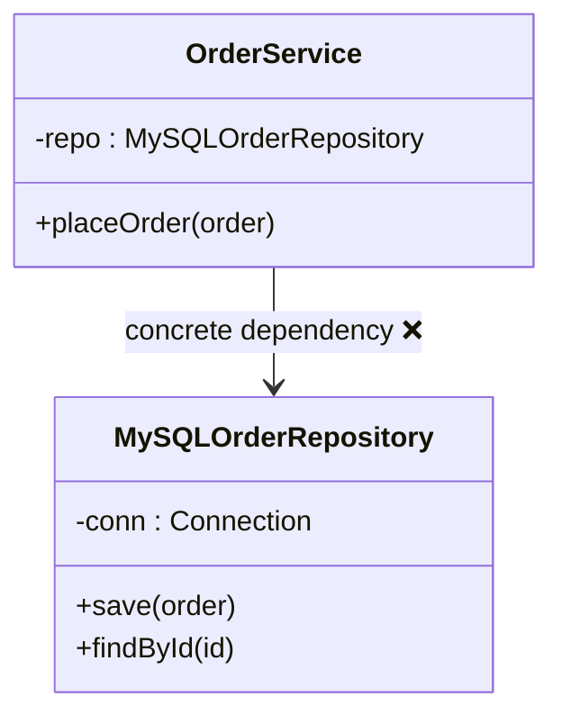
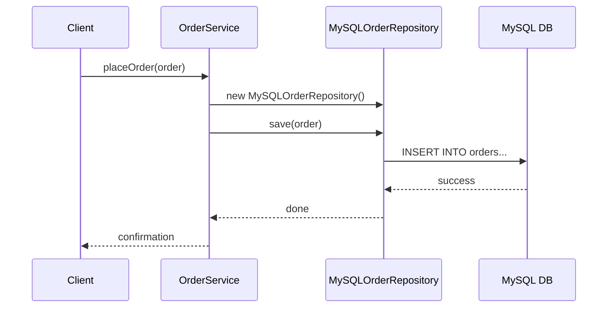
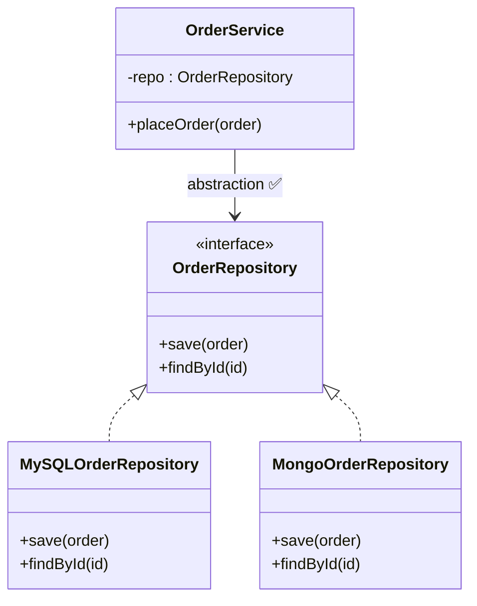
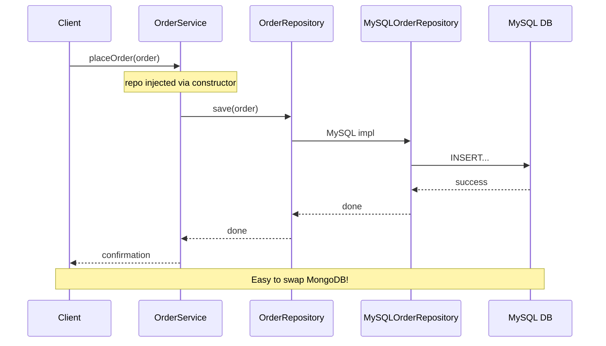

### Dependency Inversion Principle (DIP)

- High-level modules should not depend on low-level modules. Both should depend on abstractions.
- Abstractions should not depend on details. Details should depend on abstractions.


#### Example

Bad implementation with tight coupling.

```java
// Low-level concrete class
public class MySQLOrderRepository {
    private final Connection conn;

    public MySQLOrderRepository() {
        // Hardcoded MySQL connection
        this.conn = DriverManager.getConnection("jdbc:mysql://localhost:3306/orders");
    }

    public void save(Order order) {
        // MySQL-specific INSERT
        System.out.println("Saving to MySQL: " + order.id());
    }

    public Order findById(String id) {
        // MySQL-specific SELECT
        return new Order(id, List.of());
    }
}

// High-level module directly depends on low-level concrete class
public class OrderService {
    private final MySQLOrderRepository repo;

    public OrderService() {
        this.repo = new MySQLOrderRepository();  // Tight coupling!
    }

    public void placeOrder(Order order) {
        repo.save(order);
        System.out.println("Order placed");
    }
}
```

Problems: 
- Can't switch to MongoDB without rewriting `OrderService`. 
- Hard to test (no mock DB).

Class diagram for the bad implementation



High-level `OrderService` depends directly on low-level `MySQLOrderRepository`.

Sequence diagram for the bad implementation



OrderService creates and depends on concrete MySQLOrderRepository.


Let's refactor this implementation to make `OrderService` independent of the MySQL DB implementation.

```java
// Abstraction (both high/low levels depend on this)
public interface OrderRepository {
    void save(Order order);
    Order findById(String id);
}

// Low-level implementations
public class MySQLOrderRepository implements OrderRepository {
    private final Connection conn;

    public MySQLOrderRepository(String jdbcUrl) {
        this.conn = DriverManager.getConnection(jdbcUrl);
    }

    @Override
    public void save(Order order) {
        System.out.println("Saving to MySQL: " + order.id());
    }

    @Override
    public Order findById(String id) {
        return new Order(id, List.of());
    }
}

public class MongoOrderRepository implements OrderRepository {
    @Override
    public void save(Order order) {
        System.out.println("Saving to MongoDB: " + order.id());
    }

    @Override
    public Order findById(String id) {
        return new Order(id, List.of());
    }
}

// High-level module depends only on abstraction
public class OrderService {
    private final OrderRepository repo;  // Abstraction!

    // Dependency injection via constructor
    public OrderService(OrderRepository repo) {
        this.repo = repo;
    }

    public void placeOrder(Order order) {
        repo.save(order);  // Polymorphic call
        System.out.println("Order placed");
    }
}

// USAGE
OrderService mysqlService = new OrderService(new MySQLOrderRepository("jdbc:mysql://..."));
OrderService mongoService = new OrderService(new MongoOrderRepository());

```
Now, we can switch databases without touching OrderService!

class diagram



Both high-level (OrderService) and low-level (MySQLOrderRepository) depend on OrderRepository abstraction.

Sequence diagram for the good implementation.


DIP in one line: "Don't create your dependencies—receive them." Use dependency injection + interfaces.
