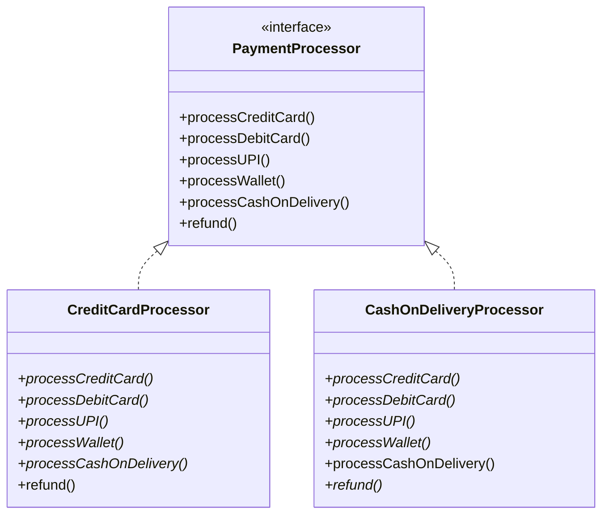
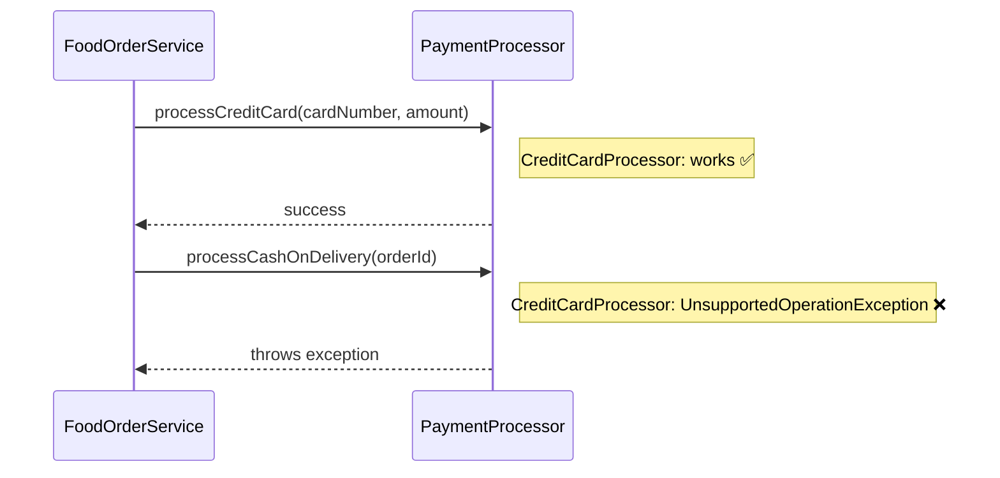
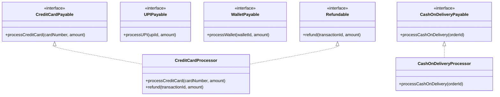
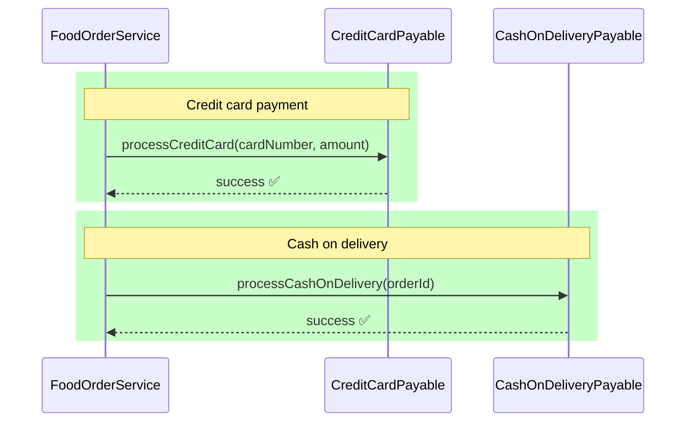

### Interface Segregation Principle (ISP)

Clients should not be forced to depend upon interfaces that they don't use.

**Example**

In the food‑ordering app, let's model payment processors—some support cards, some wallets, some cash. A fat interface forces unnecessary methods.

```java
public interface PaymentProcessor {
    boolean processCreditCard(String cardNumber, double amount);
    boolean processDebitCard(String cardNumber, double amount);
    boolean processUPI(String upiId, double amount);
    boolean processWallet(String walletId, double amount);
    boolean processCashOnDelivery(String orderId);
    void refund(String transactionId, double amount);
}
```

`CreditCardProcessor` is forced to implement 5 methods it doesn't need, violating ISP.

```java
public class CreditCardProcessor implements PaymentProcessor {
    @Override
    public boolean processCreditCard(String cardNumber, double amount) {
        // Real logic
        return true;
    }

    @Override
    public boolean processDebitCard(String cardNumber, double amount) {
        throw new UnsupportedOperationException("Debit not supported"); // Forced!
    }

    @Override
    public boolean processUPI(String upiId, double amount) {
        throw new UnsupportedOperationException("UPI not supported"); // Forced!
    }

    // ... 3 more empty/throwing methods
}
```

The corresponding bad class diagram 



The corresponding bad sequence diagram is



Client code expecting PaymentProcessor can't safely use subtypes that throw unexpected exceptions.

ISP compliant design (segregated interfaces)

```java
public interface CreditCardPayable {
    boolean processCreditCard(String cardNumber, double amount);
}

public interface UPIPayable {
    boolean processUPI(String upiId, double amount);
}

public interface WalletPayable {
    boolean processWallet(String walletId, double amount);
}

public interface CashOnDeliveryPayable {
    boolean processCashOnDelivery(String orderId);
}

public interface Refundable {
    void refund(String transactionId, double amount);
}
```

Clean implementations

```java
public class CreditCardProcessor implements CreditCardPayable, Refundable {
    @Override
    public boolean processCreditCard(String cardNumber, double amount) {
        // Real logic
        return true;
    }

    @Override
    public void refund(String transactionId, double amount) {
        // Real logic
    }
}

public class CashOnDeliveryProcessor implements CashOnDeliveryPayable {
    @Override
    public boolean processCashOnDelivery(String orderId) {
        // Real logic
        return true;
    }
    // No refund needed for COD
}
```
No forced implementations! Each class only implements what it needs.


Now, Client uses specific capabilities
```java
public final class FoodOrderService {

    public void processPayment(String orderId, PaymentMethod method, double amount) {
        switch (method.getType()) {
            case CREDIT_CARD -> {
                CreditCardPayable processor = (CreditCardPayable) method.getProcessor();
                processor.processCreditCard(method.getDetails(), amount);
            }
            case CASH_ON_DELIVERY -> {
                CashOnDeliveryPayable processor = (CashOnDeliveryPayable) method.getProcessor();
                processor.processCashOnDelivery(orderId);
            }
            // etc.
        }
    }
}
```
Clients only depend on the interfaces they actually use.

Class diagram (good ISP)

Each class implements only relevant interfaces—no fat dependencies.



Clean flows, no unexpected exceptions—each processor only handles its capability.