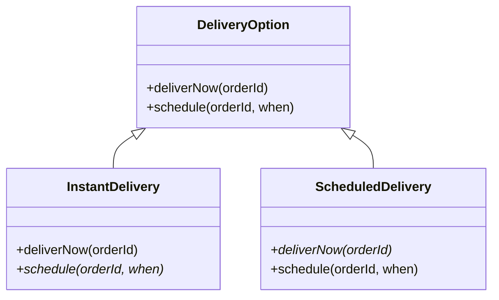
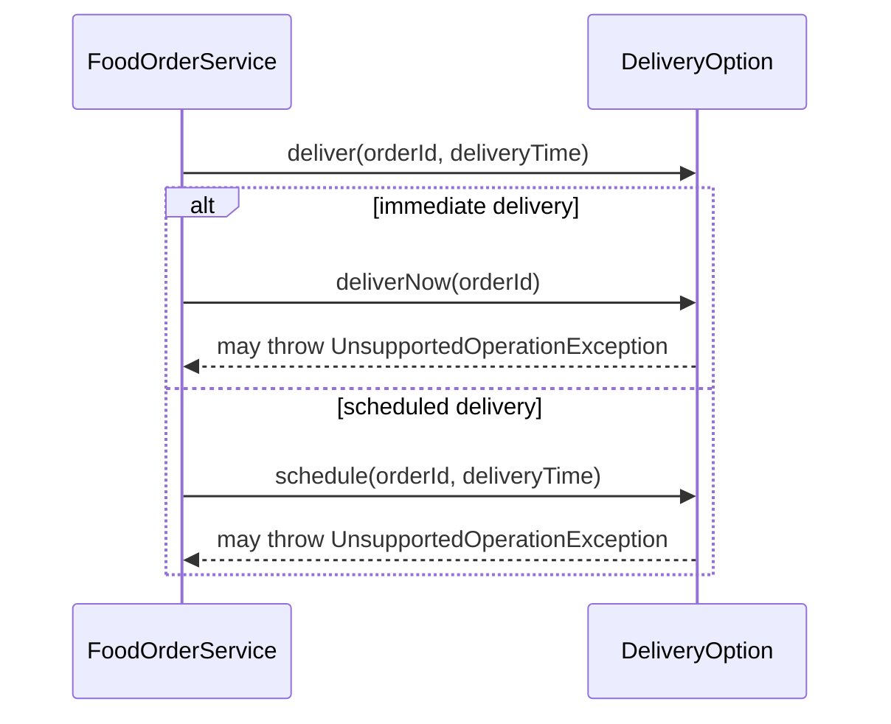
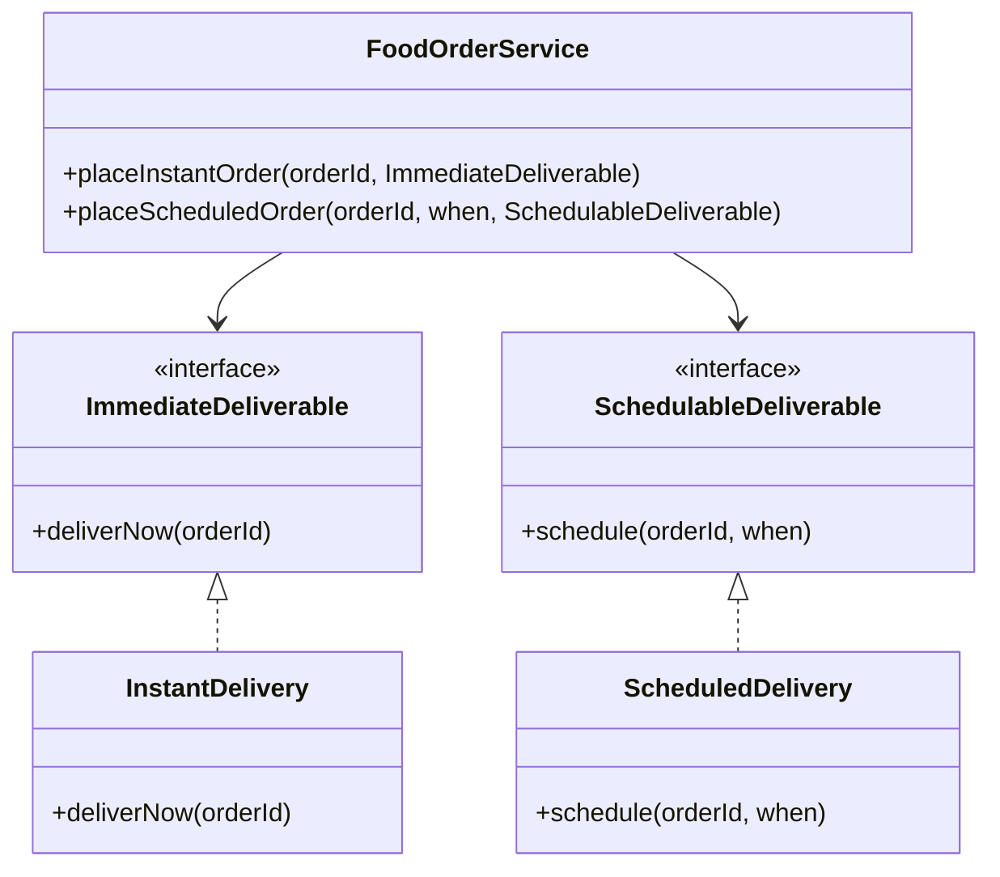
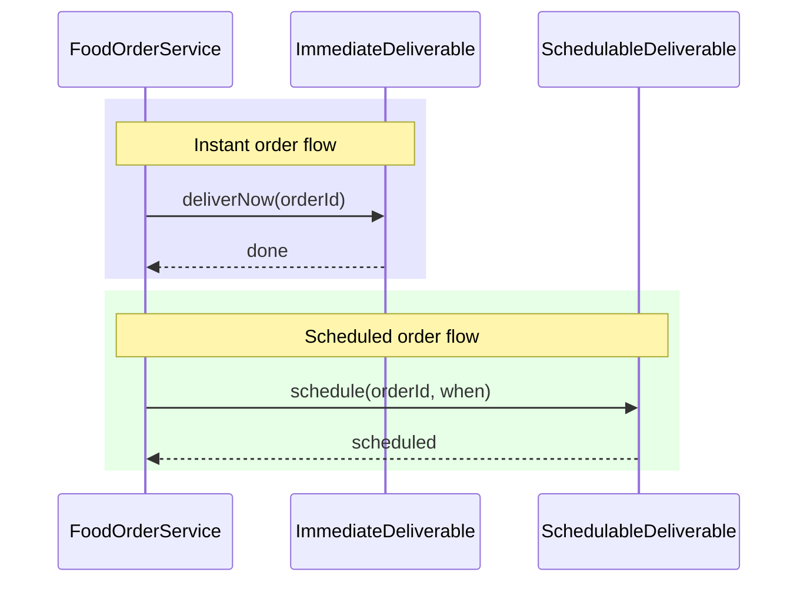

### Liskov Substitution Principle (LSP)

Intent : Derived types must be completely substitutable for their base types.

#### Example

LSP fits nicely around delivery options: some deliveries are “instant only”, some are “scheduled only”. A bad hierarchy breaks substitutability; a better one separates capabilities.

```java
public class DeliveryOption {

    public void deliverNow(String orderId) {
        System.out.println("Delivering order now: " + orderId);
    }

    public void schedule(String orderId, LocalDateTime when) {
        System.out.println("Scheduling delivery for " + when + " order: " + orderId);
    }
}

public class InstantDelivery extends DeliveryOption {
    // OK with deliverNow

    @Override
    public void schedule(String orderId, LocalDateTime when) {
        throw new UnsupportedOperationException("Instant delivery cannot be scheduled");
    }
}

public class ScheduledDelivery extends DeliveryOption {
    // OK with schedule

    @Override
    public void deliverNow(String orderId) {
        throw new UnsupportedOperationException("Scheduled delivery cannot deliver now");
    }
}
```

Client code assuming any `DeliveryOption` can do both `deliverNow` and `schedule` will blow up with `UnsupportedOperationException` for some subtypes, violating LSP.




FoodOrderService expects any DeliveryOption to safely support both operations, but some subclasses break that expectation.



We fix this by 
1. separating capabilities, and
2. only requiring what the client actually needs.

```java
public interface ImmediateDeliverable {
    void deliverNow(String orderId);
}

public interface SchedulableDeliverable {
    void schedule(String orderId, LocalDateTime when);
}

public final class InstantDelivery implements ImmediateDeliverable {

    @Override
    public void deliverNow(String orderId) {
        System.out.println("Delivering instantly: " + orderId);
    }
}

public final class ScheduledDelivery implements SchedulableDeliverable {

    @Override
    public void schedule(String orderId, LocalDateTime when) {
        System.out.println("Delivering at " + when + " order: " + orderId);
    }
}
```
Now every implementation of `ImmediateDeliverable` can be used anywhere an `ImmediateDeliverable` is needed without surprises, and the same for `SchedulableDeliverable`

The client code using abstractions correctly.

```java
public final class FoodOrderService {

    // For immediate deliveries
    public void placeInstantOrder(String orderId, ImmediateDeliverable option) {
        option.deliverNow(orderId); // any ImmediateDeliverable is valid here
    }

    // For scheduled deliveries
    public void placeScheduledOrder(String orderId,
                                    LocalDateTime when,
                                    SchedulableDeliverable option) {
        option.schedule(orderId, when); // any SchedulableDeliverable is valid here
    }
}
```

No implementation needs to throw unsupported exceptions, and the contracts are clear and consistent with LSP.



Each subtype fully supports the interface it implements; no unused or “fake” methods, so substitutability holds.




In both flows, any concrete implementation of the respective interface can replace another without changing behavior, which is exactly LSP.
