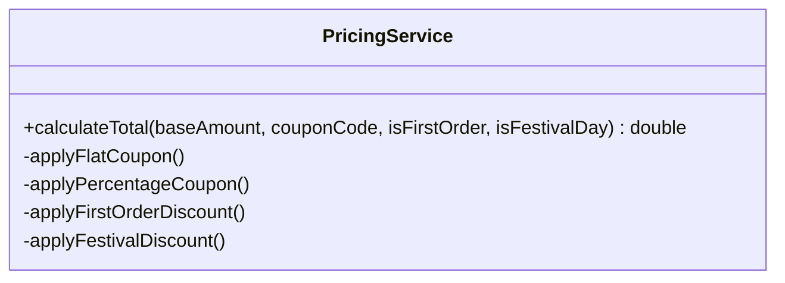
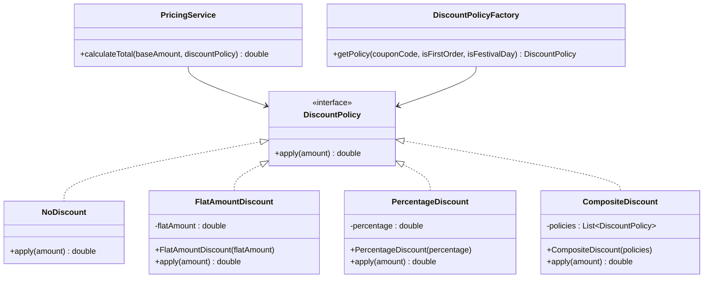
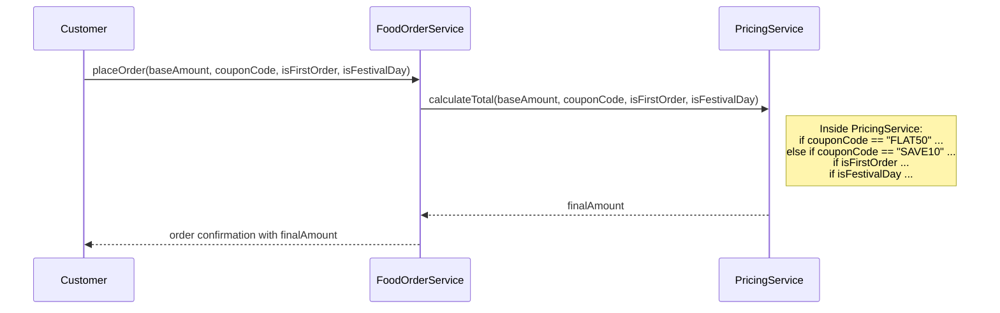
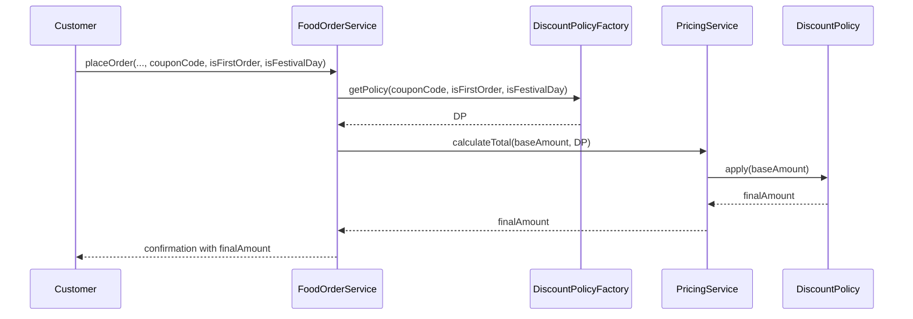

### Open Closed Principle (OCP)

Intent: Software entities like classes, modules and functions should be open for extension but closed for modifications.

#### Example

What if we need to handle different types of discounts to calculate the final price?
A bad way: add mulitple if/else or switch statements to the current `PricingService` implementation.

```java
public class PricingService {

    public double calculateTotal(double baseAmount,
                                 String couponCode,
                                 boolean isFirstOrder,
                                 boolean isFestivalDay) {

        double discounted = baseAmount;

        // Flat coupon
        if (couponCode != null && couponCode.equals("FLAT50")) {
            discounted -= 50;
        }

        // Percentage coupon
        if (couponCode != null && couponCode.equals("SAVE10")) {
            discounted *= 0.9;
        }

        // First-order discount
        if (isFirstOrder) {
            discounted *= 0.95;
        }

        // Festival day discount
        if (isFestivalDay) {
            discounted *= 0.8;
        }

        return Math.max(discounted, 0);
    }
}
```

To add a new rule like “Weekend discount”, you must edit this class and add another condition, violating OCP.

Class diagram with the bad implementation which violates OCP.



PricingService keeps growing every time business adds a new discount type.

Several design patterns facilitate OCP:

- Strategy Pattern: As seen in our example, allows algorithms to be selected at runtime.
- Decorator Pattern: Allows adding responsibilities to objects dynamically.
- Template Method Pattern: Defines the skeleton of an algorithm in a superclass but lets subclasses override specific steps.
- Factory Pattern (and Abstract Factory): Can be used to create instances of different classes that implement a common interface, allowing new types to be added easily.
- Observer Pattern: Allows objects to subscribe to events and react to them, enabling new subscribers to be added without changing the event publisher.

To refactor this example per OCP, we rely on the **Strategy Pattern** to calculate discounts.

```java
public interface DiscountPolicy {
    double apply(double amount);
}

// No discount
public final class NoDiscount implements DiscountPolicy {
    @Override
    public double apply(double amount) {
        return amount;
    }
}

// Flat amount coupon, e.g., FLAT50
public final class FlatAmountDiscount implements DiscountPolicy {

    private final double flatAmount;

    public FlatAmountDiscount(double flatAmount) {
        this.flatAmount = flatAmount;
    }

    @Override
    public double apply(double amount) {
        return Math.max(0, amount - flatAmount);
    }
}

// Percentage discount, e.g., 10% off
public final class PercentageDiscount implements DiscountPolicy {

    private final double percentage; // 0.10 for 10%

    public PercentageDiscount(double percentage) {
        this.percentage = percentage;
    }

    @Override
    public double apply(double amount) {
        return amount * (1 - percentage);
    }
}

// Composable discount that chains multiple policies
public final class CompositeDiscount implements DiscountPolicy {

    private final List<DiscountPolicy> policies;

    public CompositeDiscount(List<DiscountPolicy> policies) {
        this.policies = List.copyOf(policies);
    }

    @Override
    public double apply(double amount) {
        double result = amount;
        for (DiscountPolicy policy : policies) {
            result = policy.apply(result);
        }
        return result;
    }
}

```

Now, the `PricingService` never changes as you introduce new discount types; you only add more `DiscountPolicy` implementations.

```java
public final class PricingService {

    public double calculateTotal(double baseAmount, DiscountPolicy discountPolicy) {
        return discountPolicy.apply(baseAmount);
    }
}
```

Only this factory may change when your business rules change; the core `PricingService` and existing discount classes remain untouched, honoring OCP.

```java
public final class DiscountPolicyFactory {

    public DiscountPolicy getPolicy(String couponCode,
                                   boolean isFirstOrder,
                                   boolean isFestivalDay) {

        List<DiscountPolicy> policies = new ArrayList<>();

        if (couponCode == null || couponCode.isBlank()) {
            policies.add(new NoDiscount());
        } else if (couponCode.equals("FLAT50")) {
            policies.add(new FlatAmountDiscount(50));
        } else if (couponCode.equals("SAVE10")) {
            policies.add(new PercentageDiscount(0.10));
        }

        if (isFirstOrder) {
            policies.add(new PercentageDiscount(0.05));
        }

        if (isFestivalDay) {
            policies.add(new PercentageDiscount(0.20));
        }

        if (policies.isEmpty()) {
            return new NoDiscount();
        }

        if (policies.size() == 1) {
            return policies.getFirst();
        }

        return new CompositeDiscount(policies);
    }
}
```

Class diagram with strategy hierarchy



Adding `WeekendDiscount` or `LoyaltyDiscount` means adding another class that implements DiscountPolicy; existing classes stay closed to modification.

#### Sequence Diagram

Before applying OCP



After applying OCP



The flow for calculating price does not change when a new discount type is introduced; only the list of available DiscountPolicy implementations grows.
