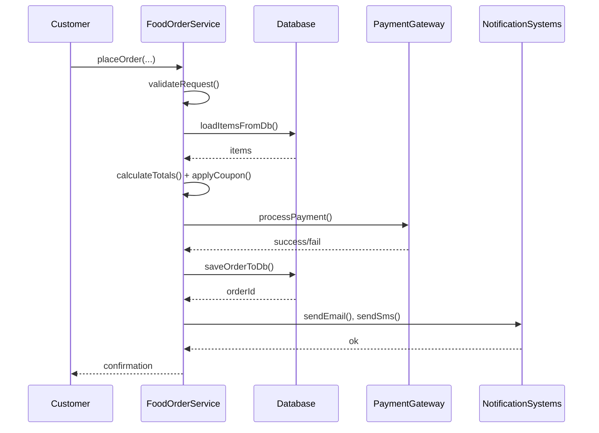
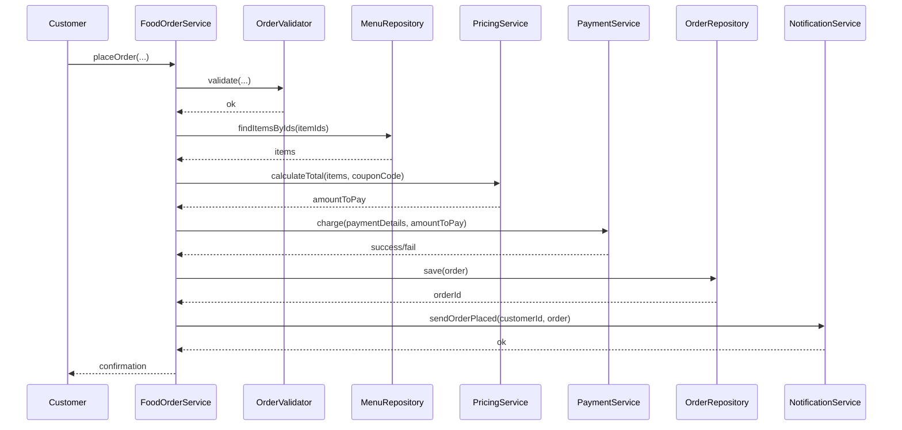

### Single Responsibilty Principle (SRP)

Intent: A software entity (class, interface etc.) should have only one reason to change.

#### Example

This single class does too many things: validates orders, calculates totals, applies discounts, talks to the database, and sends notifications.

```java
public class FoodOrderService {

    public void placeOrder(String customerId,
                           List<String> itemIds,
                           String address,
                           String paymentDetails,
                           String couponCode) {

        // 1. Validate input
        if (customerId == null || customerId.isBlank()) {
            throw new IllegalArgumentException("Invalid customer");
        }
        if (itemIds == null || itemIds.isEmpty()) {
            throw new IllegalArgumentException("No items selected");
        }

        // 2. Fetch menu items from DB (fake)
        List<MenuItem> items = loadItemsFromDb(itemIds);

        // 3. Calculate total
        double subtotal = 0.0;
        for (MenuItem item : items) {
            subtotal += item.price();
        }

        // 4. Apply coupon
        double discount = 0.0;
        if (couponCode != null && !couponCode.isBlank()) {
            if (couponCode.equals("NEW50")) {
                discount = subtotal * 0.5;
            } else if (couponCode.equals("FREEDESSERT")) {
                discount = 100.0;
            }
        }
        double finalAmount = subtotal - discount;

        // 5. Process payment (fake)
        if (!processPayment(paymentDetails, finalAmount)) {
            throw new RuntimeException("Payment failed");
        }

        // 6. Save order to DB (fake)
        String orderId = saveOrderToDb(customerId, items, address, finalAmount);

        // 7. Send notifications (email + SMS)
        sendEmail(customerId, orderId, finalAmount);
        sendSms(customerId, orderId);

        System.out.println("Order placed successfully: " + orderId);
    }

    // ----- Everything below is also crammed into this class -----

    private List<MenuItem> loadItemsFromDb(List<String> itemIds) {
        // DB logic here
        return List.of(); // stub
    }

    private boolean processPayment(String paymentDetails, double amount) {
        // Payment gateway logic
        return true; // stub
    }

    private String saveOrderToDb(String customerId,
                                 List<MenuItem> items,
                                 String address,
                                 double finalAmount) {
        // Insert into orders table
        return "ORDER123"; // stub
    }

    private void sendEmail(String customerId, String orderId, double amount) {
        // SMTP logic here
    }

    private void sendSms(String customerId, String orderId) {
        // SMS gateway logic
    }

    public record MenuItem(String id, String name, double price) {}
}
```

Problems (multiple responsibilities):

- Validation logic
- Pricing and discount logic
- Payment processing
- Persistence (DB) logic
- Notification (email/SMS) logic

Any change in discount rules, payment integration, email templates, or DB schema forces changes in this one class.

As per SRP, we split responsibilities into cohesive classes, keeping one main orchestrator.

```java
// 1 Core domain types
public record MenuItem(String id, String name, double price) {}

public record Order(
        String id,
        String customerId,
        List<MenuItem> items,
        String deliveryAddress,
        double amountToPay
) {}
```

```java
// 2 Responsibility‑focused services
public class OrderValidator {
    public void validate(String customerId, List<String> itemIds, String address) {
        if (customerId == null || customerId.isBlank()) {
            throw new IllegalArgumentException("Invalid customer");
        }
        if (itemIds == null || itemIds.isEmpty()) {
            throw new IllegalArgumentException("No items selected");
        }
        if (address == null || address.isBlank()) {
            throw new IllegalArgumentException("Invalid address");
        }
    }
}

public class MenuRepository {
    public List<MenuItem> findItemsByIds(List<String> itemIds) {
        // Only menu lookup logic here
        return List.of(); // stub
    }
}

public class PricingService {
    public double calculateTotal(List<MenuItem> items, String couponCode) {
        double subtotal = items.stream()
                .mapToDouble(MenuItem::price)
                .sum();

        double discount = switch (couponCode) {
            case "NEW50" -> subtotal * 0.5;
            case "FREEDESSERT" -> 100.0;
            case null, default -> 0.0;
        };

        return subtotal - discount;
    }
}

public class PaymentService {
    public boolean charge(String paymentDetails, double amount) {
        // Only payment logic here
        return true; // stub
    }
}

public class OrderRepository {
    public String save(Order order) {
        // Only DB persistence here
        return order.id(); // stub
    }
}

public class NotificationService {
    public void sendOrderPlaced(String customerId, Order order) {
        sendEmail(customerId, order);
        sendSms(customerId, order);
    }

    private void sendEmail(String customerId, Order order) {
        // email logic
    }

    private void sendSms(String customerId, Order order) {
        // sms logic
    }
}
```

Each class now has a single reason to change: validation rules, pricing rules, payment integration, database schema, or notification templates respectively.

```java
// 3 Thin orchestrator FoodOrderService
public class FoodOrderService {

    private final OrderValidator validator;
    private final MenuRepository menuRepository;
    private final PricingService pricingService;
    private final PaymentService paymentService;
    private final OrderRepository orderRepository;
    private final NotificationService notificationService;

    public FoodOrderService(OrderValidator validator,
                            MenuRepository menuRepository,
                            PricingService pricingService,
                            PaymentService paymentService,
                            OrderRepository orderRepository,
                            NotificationService notificationService) {
        this.validator = validator;
        this.menuRepository = menuRepository;
        this.pricingService = pricingService;
        this.paymentService = paymentService;
        this.orderRepository = orderRepository;
        this.notificationService = notificationService;
    }

    public void placeOrder(String customerId,
                           List<String> itemIds,
                           String address,
                           String paymentDetails,
                           String couponCode) {

        // 1. Validate request
        validator.validate(customerId, itemIds, address);

        // 2. Load menu items
        List<MenuItem> items = menuRepository.findItemsByIds(itemIds);

        // 3. Price calculation
        double amountToPay = pricingService.calculateTotal(items, couponCode);

        // 4. Payment
        if (!paymentService.charge(paymentDetails, amountToPay)) {
            throw new RuntimeException("Payment failed");
        }

        // 5. Persist order
        Order order = new Order(
                generateOrderId(),
                customerId,
                items,
                address,
                amountToPay
        );
        orderRepository.save(order);

        // 6. Notify customer
        notificationService.sendOrderPlaced(customerId, order);
    }

    private String generateOrderId() {
        return "ORD-" + System.currentTimeMillis();
    }
}
```

Now `FoodOrderService` is just an orchestrator coordinating specialized components rather than doing everything itself.

#### Sequence Diagram

Before refactor (one class doing everything)



All responsibilities live inside `F: FoodOrderService`.

After refactor (orchestrator + collaborators)



The flow is the same, but the work is split across cohesive services, which is exactly what SRP aims for.
